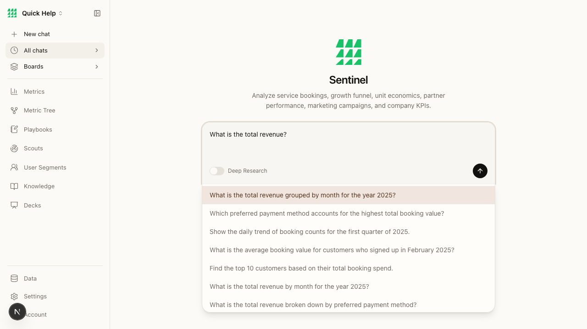

# BEAD-003: Chat submit button unresponsive / timeout on click

**Severity:** HIGH
**Category:** Functional
**Page:** / (Home)
**Ship-Readiness Impact:** SHIP_WITH_CONCERNS

---

## Summary

After typing a query in the chat input, clicking the send button (@e45) times out with a 5-second wait. The button appears to remain in a disabled state even after text is entered. Submission may require pressing Enter instead of clicking, but this isn't discoverable.

## Evidence

### Interaction log

```
$B fill @e43 "What is the total revenue?"    → Filled @e43
$B click @e45                                 → Operation timed out: click: Timeout 5000ms exceeded.
```

The button `@e45` was tagged `[disabled]` in the initial snapshot:
```
@e45 [button] [disabled]
```

After filling the input, the autocomplete listbox appeared (indicating the input registered), but the send button remained unclickable via programmatic click.

### Autocomplete did trigger



Network traffic confirmed autocomplete API calls succeeded:
```
POST http://localhost:3003/api/complete → 200 (4648ms, 346B)
POST http://localhost:3003/api/complete → 200 (3995ms, 354B)
```

## Root Cause (source trace)

**File:** `src/components/chat/chat-input.tsx` (line 413)

```tsx
disabled={!value.trim() && !isProcessing && contextRefs.length === 0}
```

The disabled condition checks `value.trim()`. When `$B fill` sets the input value programmatically, it may not trigger React's synthetic onChange event, leaving the internal `value` state as `""` even though the DOM input shows text. This causes the button to remain disabled.

This is a **Playwright/headless browser interaction issue** — but it also reveals that:
1. There's no visual affordance telling the user "press Enter to send" (no tooltip, no label)
2. The send button's disabled state is visually subtle (slight opacity change only)

## Repro Steps

1. Navigate to http://localhost:3003
2. Type in the chat input "What is the total revenue?"
3. Observe autocomplete suggestions appear
4. Click the send (arrow-up) button
5. Expected: message sends. Actual: button may not respond if React state didn't sync

## Impact

- Headless browser testing can't reliably trigger chat submission
- Users who click instead of pressing Enter may experience confusion
- No "press Enter to send" hint visible in the UI
