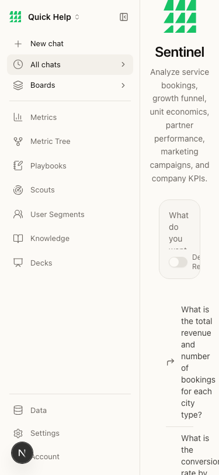

# BEAD-004: Mobile layout completely broken — sidebar overlaps content

**Severity:** HIGH
**Category:** Visual/UI + Responsive
**Page:** ALL pages at 375px viewport
**Ship-Readiness Impact:** BLOCK (for mobile users)

---

## Summary

At mobile viewport (375px × 812px), the sidebar renders at full width alongside the main content. There is no hamburger menu, no collapse behavior, no responsive breakpoint. The sidebar takes ~220px of the 375px screen, leaving the main content area squished into ~155px where text wraps to single words per line and the chat input is unusable.

## Screenshot



## What's visible at 375px

- Full sidebar navigation (all nav items, including Metrics, Playbooks, Scouts, etc.)
- Main content squeezed to right side
- Chat input "What do you want to..." wraps mid-word
- "Deep Research" toggle label truncated
- Prompt suggestion text wraps to 2-3 words per line, making them unreadable
- Overall: **app is unusable on mobile**

## Root Cause (source trace)

**File:** `src/components/sidebar.tsx` (line 267)

```tsx
style={{ width: collapsed ? 56 : 240 }}
```

The sidebar width is controlled by a `collapsed` state stored in localStorage. There is no responsive breakpoint that automatically collapses the sidebar on small viewports. The sidebar renders at 240px (or 56px if manually collapsed) regardless of screen width.

**What's missing:**
- No `@media (max-width: 768px)` handling
- No hamburger menu component
- No automatic collapse on mobile
- No `hidden md:block` or similar responsive class on the sidebar

The sidebar has collapse/expand behavior (lines 94, 125-133):
```tsx
sidebarCollapsed: collapsed, setSidebarCollapsed: setCollapsed,
// ...
useEffect(() => {
  const stored = localStorage.getItem("sidebar-collapsed");
  // ...
  localStorage.setItem("sidebar-collapsed", String(collapsed));
}, [collapsed]);
```

But this is manual toggle only — not responsive.

## Comparison: Desktop vs Mobile

| Viewport | Sidebar | Content Area | Usable? |
|----------|---------|-------------|---------|
| Desktop (1280px) | 240px, appropriate | ~1040px, full width | ✓ |
| Mobile (375px) | 240px, NO collapse | ~135px, text wraps to gibberish | ✗ |

## Repro Steps

1. Open http://localhost:3003 in a browser
2. Resize viewport to 375px wide (or use DevTools device emulation for iPhone)
3. Observe sidebar taking 60%+ of screen width
4. Try to use the chat input — impossible

## Impact

- App is completely unusable on phones
- Tablet is partially affected (sidebar takes significant space)
- No mobile-first or responsive design implemented for navigation
