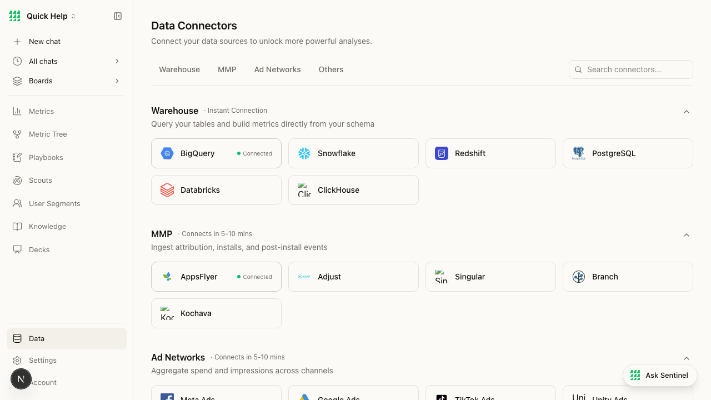

# BEAD-005: Connector page — 400 errors and clipped logos

**Severity:** MEDIUM
**Category:** Dev/Infrastructure + Visual/UI
**Page:** /connectors
**Ship-Readiness Impact:** SHIP_WITH_CONCERNS

---

## Summary

The Data Connectors page (`/connectors`) triggers four 400 Bad Request errors on page load for connector logo images. Additionally, several connector card logos are visually clipped — "ClickHouse" shows as "Clic" and "Singular" shows as "Sin" because the logo images overflow their containers.

## Screenshot



## Console Output

```
[error] Failed to load resource: the server responded with a status of 400 (Bad Request)  × 4
[warning] Image with src "https://fivetran.com/integrations/tiktok_ads/resources/tiktok-logo.svg" 
  has either width or height modified, but not the other.
[warning] Image with src "https://fivetran.com/integrations/mixpanel/resources/mixpanel.svg" ...
[warning] Image with src "https://fivetran.com/integrations/databricks/resources/databricks.png" ...
[warning] Image with src "https://fivetran.com/integrations/bigquery/connector/resources/logo.png" ...
```

## Root Cause (source trace)

### 400 errors
**File:** `src/lib/connector-logos.ts` (line 11+)

Logo URLs are hardcoded to `fivetran.com` integration pages:
```typescript
"https://fivetran.com/integrations/bigquery/connector/resources/logo.png",
"https://fivetran.com/integrations/snowflake/connector/resources/snowflake.png",
"https://fivetran.com/integrations/databricks/resources/databricks.png",
```

Some of these URLs return 400 — likely the Fivetran resource URLs have changed or require specific referrer/auth headers.

### Image dimension warnings
**File:** `src/components/connectors/connector-logo.tsx` (line 40)

```tsx
<Image
  src={logoUrl}
  // ... missing width:"auto" or height:"auto"
```

Next.js `Image` component requires both width and height when one is modified. The component sets a container size but doesn't pass the correct dimension props.

### Logo clipping
The container at line 33-36:
```tsx
<div
  className={`flex items-center justify-center shrink-0 overflow-hidden ${className}`}
  style={{ width: size, height: size }}
>
```

`overflow-hidden` clips logos that are wider than `size` (36px default). Logos with text (ClickHouse, Singular) extend beyond the square container.

### Next.js image config
**File:** `next.config.ts` (lines 11-13)
```typescript
images: {
  remotePatterns: [
    { protocol: "https", hostname: "fivetran.com" },
  ],
}
```

The domain is whitelisted, but some specific resource URLs still return 400.

## Visual Evidence

| Connector | Logo Display | Issue |
|-----------|-------------|-------|
| BigQuery | ✓ Full logo | — |
| Snowflake | ✓ Full logo | — |
| ClickHouse | ✗ Shows "Clic" | Clipped by overflow-hidden |
| Singular | ✗ Shows "Sin" | Clipped by overflow-hidden |
| Kochava | ✗ Shows "Koc" | Clipped by overflow-hidden |

## Repro Steps

1. Navigate to http://localhost:3003/connectors
2. Open browser console
3. Observe 4x 400 errors and 4x image dimension warnings
4. Scroll to see ClickHouse, Singular, Kochava cards with clipped logos
