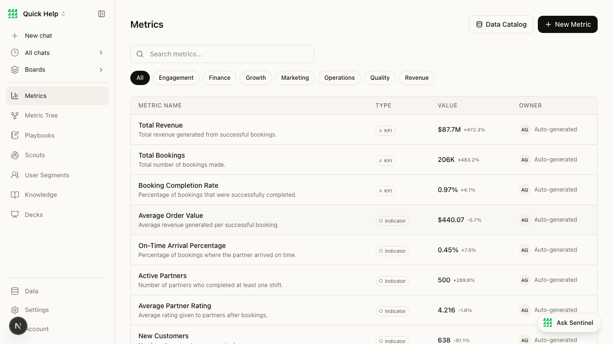

# BEAD-006: Metrics page — 14-second API load with no loading state

**Severity:** MEDIUM
**Category:** Performance + Product
**Page:** /metrics
**Ship-Readiness Impact:** SHIP_WITH_CONCERNS

---

## Summary

The Metrics page makes a single API call `GET /api/metrics?datasetId=quickhelp` that takes ~14 seconds to respond. During this entire time, the page shows the table headers (METRIC NAME, TYPE, VALUE, OWNER) with an empty body — no loading skeleton, no spinner, no "Loading metrics..." text. The user has no feedback that data is being fetched.

## Screenshot



## Network Evidence

```
GET http://localhost:3003/api/metrics?datasetId=quickhelp → 200 (13977ms, 520382B)
```

- **Response time:** 13,977ms (~14 seconds)
- **Response size:** 520KB (508KB of metrics JSON)
- **During load:** Empty table body visible, no loading indicator

## Root Cause (source trace)

**File:** `src/app/api/metrics/route.ts` (lines 32-72)

The metrics API reads metric definitions from a JSON file, then executes SQL queries for each metric's `valueSql` and `timeSeriesSql` against DuckDB:

```typescript
const metricsPath = join(DATASETS_DIR, datasetId, "metrics.json");
// ... reads all metric definitions
// Then for EACH metric, runs valueSql + timeSeriesSql against DuckDB
```

With 30 metrics (as shown in the Metric Tree: "Total Metrics: 30"), this means ~60 SQL queries executed sequentially, adding up to ~14 seconds.

**What's missing in the frontend:**

The page component likely uses `useEffect` + `apiFetch` to load metrics, but there's no intermediate loading state rendered while the promise is pending.

## State Coverage

| Feature | Loading | Empty | Error | Success | Partial |
|---------|---------|-------|-------|---------|---------|
| Metrics table | ✗ MISSING | — | ✗ UNKNOWN | ✓ | ✗ |
| Category filters | ✓ (render immediately) | — | — | ✓ | — |
| Search | ✓ (render immediately) | — | — | ✓ | — |

## Impact

- User sees blank table for 14 seconds with no indication data is loading
- On slower connections or larger datasets, could be 30+ seconds
- User may think the page is broken and navigate away
- Compare to Knowledge page which shows proper empty state with CTAs

## Repro Steps

1. Navigate to http://localhost:3003/metrics
2. Observe empty table body (headers only)
3. Wait ~14 seconds
4. Metrics populate
