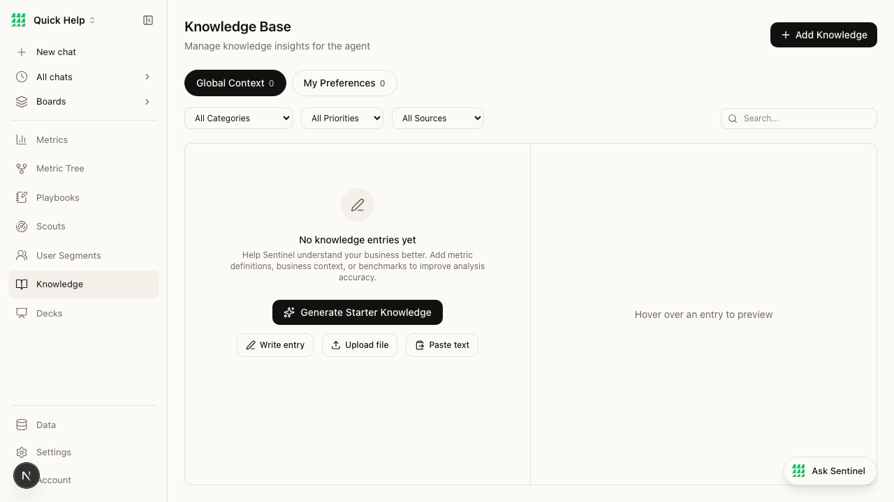
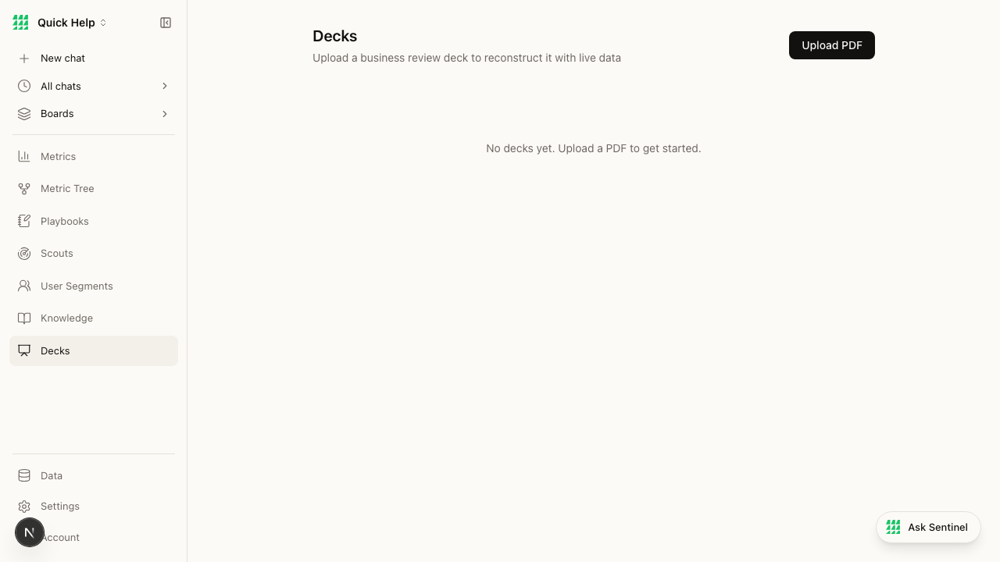
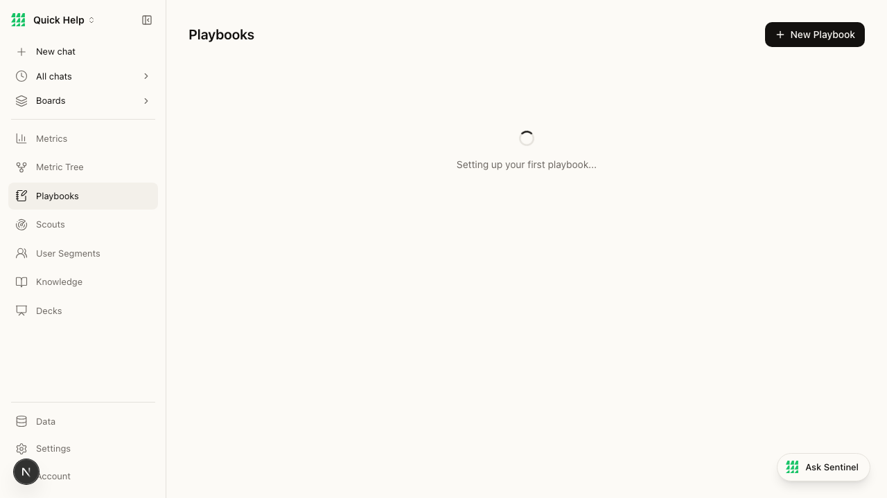

# BEAD-008: Inconsistent empty state patterns across pages

**Severity:** LOW
**Category:** Product
**Pages:** /decks, /knowledge (exemplar), /playbooks (broken)
**Ship-Readiness Impact:** Polish

---

## Summary

The app has inconsistent empty state patterns. The Knowledge page sets the gold standard with icon + heading + description + multiple CTA buttons. Other pages either show plain text (Decks) or break entirely (Playbooks). Empty states are a critical product moment — they're the first thing a new user sees.

## Screenshots

### Knowledge (GOOD — exemplar)

- ✓ Icon (pen/edit icon, muted)
- ✓ Heading: "No knowledge entries yet"
- ✓ Description: "Help Sentinel understand your business better..."
- ✓ Primary CTA: "Generate Starter Knowledge" (prominent, dark)
- ✓ Secondary CTAs: "Write entry", "Upload file", "Paste text"
- ✓ Right panel: "Hover over an entry to preview" (contextual help)

### Decks (POOR — plain text)

- ✗ No icon
- ✗ No heading distinction
- ✗ Plain text only: "No decks yet. Upload a PDF to get started."
- ✗ No inline CTA (button is in the topbar only)
- ✗ No visual hierarchy

### Playbooks (BROKEN — infinite loading)

- ✗ Shows spinner forever
- ✗ No error state
- ✗ No fallback empty state
- ✗ See BEAD-001

## Comparison Table

| Page | Icon | Heading | Description | CTA Buttons | Rating |
|------|------|---------|-------------|-------------|--------|
| Knowledge | ✓ | ✓ | ✓ | ✓ (4 options) | ★★★★★ |
| Segments | — | — | — | — (has data) | N/A |
| Scouts | — | — | — | — (has data) | N/A |
| Decks | ✗ | ✗ | ✗ (plain text) | ✗ | ★★☆☆☆ |
| Playbooks | ✗ | ✗ | ✗ (stuck) | ✗ | ★☆☆☆☆ |

## Recommendation

Standardize all empty states to match Knowledge page pattern:
1. Muted icon (from Lucide)
2. Heading: "No {entities} yet"
3. Description: 1-2 sentences explaining what this feature does
4. Primary CTA button (dark/prominent)
5. Optional secondary CTAs

This is a 30-minute fix per page — classic "boil the lake" opportunity.
