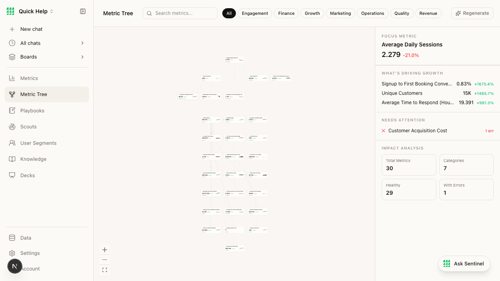

# BEAD-009: Metric tree visualization hard to read at default zoom

**Severity:** LOW
**Category:** Product + UX
**Page:** /metric-tree
**Ship-Readiness Impact:** Polish

---

## Summary

The Metric Tree page renders a tree visualization that is too small to read at default zoom. Node labels show abbreviated numbers and truncated metric names, but the tree structure lacks explanatory labels for the relationships between metrics. The right panel shows useful summary data ("FOCUS METRIC", "WHAT'S DRIVING GROWTH", "NEEDS ATTENTION") but the connection between the panel and the tree nodes isn't visually clear.

## Screenshot

## Observations

### What works
- Right panel has good information density: focus metric, growth drivers, needs-attention alerts
- "NEEDS ATTENTION: Customer Acquisition Cost 1 err" — useful signal in red
- Impact analysis cards (Total Metrics: 30, Categories: 7, Healthy: 29, With Errors: 1)
- Zoom controls (+/−/fullscreen) available in bottom-left

### What doesn't work
1. **Tree nodes too small** — metric names and values are barely legible at default zoom. User needs to zoom in 2-3x to read individual nodes
2. **No relationship labels** — lines connect nodes but there's no label explaining the relationship (e.g., "drives", "depends on", "computed from")
3. **Focus metric connection unclear** — right panel shows "Average Daily Sessions" as focus but it's not highlighted or visually distinct in the tree
4. **Growth driver metrics** — "Signup to First Booking Conve..." is truncated in the panel. Full name not accessible without hover (which wasn't tested)
5. **Error indicator** — "1 err" on Customer Acquisition Cost is red text, but clicking/hovering on it for details wasn't accessible from the tree view

### State coverage

| Feature | Loading | Empty | Error | Success | Partial |
|---------|---------|-------|-------|---------|---------|
| Tree visualization | ✗ unknown | ✗ unknown | ✗ | ✓ | ✗ |
| Right panel | ✗ unknown | ✗ unknown | ✓ (shows "1 err") | ✓ | ✗ |

## Product Assessment

- **Information Hierarchy:** MUDDY — the tree and the panel compete for attention. It's unclear whether the user should interact with the tree or read the panel.
- **First 5 Seconds:** MARGINAL — user can see there's a tree of metrics but can't read it without zooming
- **PM Question:** "Would I use this daily?" — probably not at this zoom level. The right panel data is more immediately useful than the tree itself.
