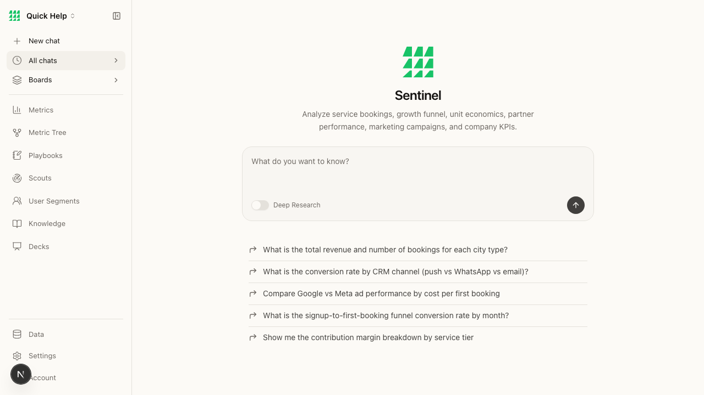
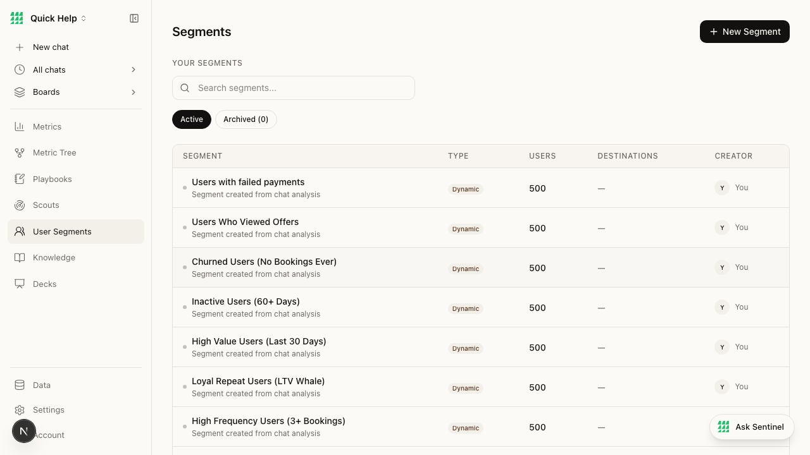
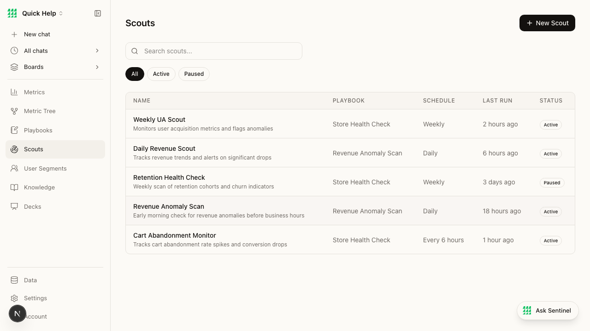

# BEAD-010: Aesthetic assessment — CRAFTED (8/10)

**Severity:** N/A (positive finding)
**Category:** Aesthetic
**Pages:** All
**Ship-Readiness Impact:** Positive

---

## Summary

The app has a deliberately crafted, monochrome visual identity that avoids common AI slop patterns. The design feels intentional and consistent, not generated. This is a strength.

## Evidence

### Typography
```json
{
  "fontFamily": "ui-sans-serif, system-ui, sans-serif",
  "fontSize": "16px",
  "lineHeight": "24px",
  "color": "lab(5.2603...)",     // near-black
  "bg": "lab(98.2748...)"        // warm off-white/cream
}
```

- System font stack (appropriate for a SaaS tool)
- 16px base size (prevents iOS zoom)
- 1.5 line height (good readability)
- Near-black on warm cream background — distinctive, not generic white

### Color Palette
- **Background:** Warm cream/beige (not pure white — intentional brand choice)
- **Primary accent:** Saturated green (logo, connected badges)
- **Text:** Near-black primary, gray secondary
- **Borders:** Subtle, consistent gray
- **Interactive:** Dark/black buttons (New Metric, New Segment, etc.)
- **Status:** Green for active/connected, gray for paused — monochrome-first per AGENTS.md convention

**Color discipline:** ✓ Fewer than 5 distinct hues. Gray family is consistent.

### AI Slop Score: CRAFTED ✓
| Pattern | Present? | Notes |
|---------|----------|-------|
| Generic purple-blue gradients | ✗ | No gradients anywhere |
| Over-rounded corners | ✗ | Consistent subtle rounding |
| Excessive shadows | ✗ | Minimal, appropriate shadows |
| Stock illustration energy | ✗ | Custom logo, no stock art |
| Rainbow badges/tags | ✗ | Strictly monochrome badges |
| Gratuitous animations | ✗ | No observed unnecessary motion |
| Dashboard-itis (meaningless cards) | Partial | Metric tree panel has useful data |

### Component Consistency
| Component | Consistent across pages? |
|-----------|------------------------|
| Sidebar | ✓ Identical on all pages, 240px width |
| Page title | ✓ Same position, same weight |
| Tables | ✓ Same header style (uppercase, small, muted) |
| "+ New X" button | ✓ Same dark button, top-right, consistent pattern |
| Search inputs | ✓ Same style with search icon |
| Filter pills | ✓ Same Active/All pill pattern (metrics, segments, scouts) |
| "Ask Sentinel" FAB | ✓ Consistent bottom-right floating button |

### Spacing
- Consistent page padding (~24px left, consistent vertical rhythm)
- Table row height consistent across metrics, segments, scouts pages
- Sidebar items well-spaced, not cramped

## Screenshots

| Page | Screenshot | Assessment |
|------|-----------|------------|
| Home |  | Clean, centered, purposeful |
| Metrics |  | Good data table, consistent styling |
| Segments |  | Matches metrics pattern |
| Scouts |  | Matches table pattern |
| Knowledge |  | Best empty state design |
| Connectors |  | Card grid, good categorization |

## Design Score Breakdown

| Dimension | Score | Notes |
|-----------|-------|-------|
| Spacing & Layout | 8/10 | Consistent, good rhythm. Minor: sidebar doesn't respond to viewport |
| Typography | 8/10 | Good hierarchy, readable sizes. System font appropriate. |
| Color | 9/10 | Excellent palette discipline. Warm cream is distinctive. |
| AI Slop (inverted) | 9/10 | No slop patterns detected. Clearly intentional design. |
| Component Consistency | 8/10 | Strong patterns. Minor: empty states inconsistent. |
| Responsive | 3/10 | Desktop-only. Mobile broken. No responsive behavior. |
| Interaction Design | 7/10 | Hover states present, focus not tested, transitions smooth. |
| **Average** | **7.4/10** | Rounds to **8/10** excluding responsive (desktop-focused app) |
