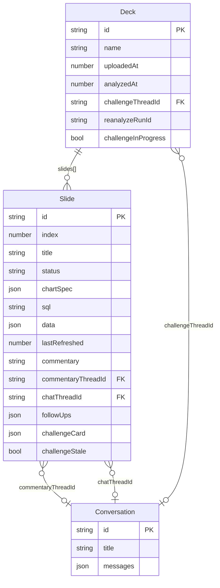

# feat: Living Deck

## Enhancement Summary

**Deepened on:** 2026-03-11
**Research agents used:** repo-research-analyst (canvas reuse), architecture-strategist, security-sentinel, performance-oracle, kieran-typescript-reviewer, julik-frontend-races-reviewer, code-simplicity-reviewer, best-practices-researcher, hydration/UI learnings

### Critical Discoveries

1. **Canvas infrastructure is fully reusable** — `ChartRenderer`, `InsightRenderer`, `shared.tsx` primitives, `computeDAGLayout`, `use-canvas-stream.ts`, and `CanvasCardPlan.derivedFrom` all apply directly. No custom canvas engine needed.
2. **`saveConversation` is localStorage-only** — cannot be called server-side. Commentary thread creation must happen client-side after stream delivers slide data.
3. **`switchConversation` is not exposed via `ChatStateProvider`** — must be threaded through before `loadConversation` can work.
4. **Auth middleware not wired** — `src/proxy.ts` is never invoked by Next.js (must be renamed `src/middleware.ts`).
5. **Simplified file structure** — cut from 16 planned files to 9 by merging stores, collapsing satellites, and reusing the existing right panel.

---

## Overview

Upload a PDF business review deck. Sentinel extracts the charts, recreates them with live DuckDB data, runs deep-research commentary per chart, and provides a deck-wide AI challenge agent — all on a canvas built from the existing React Flow infrastructure. The canvas replaces the weekly deck ritual while keeping every chart refreshable and every insight drillable.

## Problem Statement

Weekly business reviews run on static decks. Charts go stale the moment they're exported. Commentary is written once and never challenged. Sentinel already has the dataset and KPIs — this feature closes the loop by turning the deck itself into a living, AI-powered artifact.

## Proposed Solution

Five surfaces working together:

1. **`/decks`** — list of uploaded decks + upload button
2. **`/decks/[id]`** — deck canvas: horizontal scroll of slide clusters (hub chart + satellites), rendered using existing canvas card infrastructure
3. **`POST /api/decks/process`** — PDF → Gemini extraction → SQL generation → NDJSON progress stream
4. **`POST /api/decks/[id]/challenge`** — deck-wide challenge agent, creates one conversation thread
5. **Existing right panel** — slides in when "Ask about this" or Analysis satellite is clicked (no new panel component)

---

## Architecture Decisions

### Persistence: In-Memory Only (Pattern A)

Deck and slide data lives in a **single** `deck-store.ts` file — one `Map<string, Deck>` where each `Deck` holds its `slides: Slide[]` inline. No `slide-store.ts`. No localStorage. Rationale: each slide holds SQL results (up to 500 rows), commentary, and `ChartSpec`. A 10-slide deck could easily exceed the 5 MB localStorage budget. Decks lost on page reload is acceptable for this demo/prototype stage.

`deck-store.ts` follows `playbook-store.ts` Pattern A: `Map<string, T>`, no `ensureInitialized()`, call `invalidateCatalog()` on every mutation. `slideCount` is always derived from `deck.slides.length`, never stored, to prevent consistency drift.

### Commentary Thread Creation: Client-Side Only

`conversation-store.ts` uses `localStorage` — it is not available in server-side route handlers. The `POST /api/decks/process` route streams slide data to the client via NDJSON. The client creates the commentary conversation after receiving each `slide_complete` event, using `saveConversation()` client-side. The `commentaryThreadId` is then updated on the deck store via a second client-side call.

### Chat Panel: Use Existing Right Panel

`ChatPanelProvider` already manages a slide-in right panel. The deck canvas calls `loadConversation(id)` (a new method on `useChatPanel()`) which calls `switchConversation(id)` + `setRightPanelOpen(true)`. No new panel component is needed. `switchConversation` must be added to `ChatStateContextValue` interface and exposed from `ChatStateProvider` (currently missing — two-line change).

### Canvas: Reuse Existing React Flow Infrastructure

The react-flow-migration branch has a full React Flow canvas with card renderers, `computeDAGLayout`, `use-canvas-stream.ts`, and `CanvasCardPlan`. The Living Deck uses this infrastructure:

- **Hub card** → reuse `ChartRenderer` verbatim (`type: "chart"`)
- **Analysis satellite** → reuse `InsightRenderer` verbatim (`type: "insight"`)
- **Follow-ups satellite** → reuse `InsightRenderer` with `type: "follow-up"` (already handled in `CanvasCardNode` switch)
- **Challenge satellite** → new `ChallengeRenderer` (~50 lines composing existing `shared.tsx` primitives), new `type: "challenge"` in `CardType`
- **Layout** → `computeDAGLayout` with hub at layer 0, satellites at layer 1 via `derivedFrom: [hubId]`
- **Streaming** → `use-canvas-stream.ts` `processStream` with `CanvasCardPlan` graph encoding hub→satellite relationships

Satellites are added to `TARGET_ONLY` set in `canvas-adapter.ts` (no source handles).

### Challenge Thread: New Tab via `?conv=` Param

`window.open(`/?conv=${deck.challengeThreadId}`, '_blank')`. The home page already handles `?conv=<id>` (see `use-conversation.ts:109`). Validate UUID format before calling `window.open`.

### Partial Upload Failure: Save-With-Failed-State

If slide N fails, deck saved with `status: "failed"` on that slide. Canvas renders a stub card. Retry button on stub re-processes that slide only.

### Concurrency Cap: 3 Slides at a Time

Extract `runConcurrent` from `src/app/api/analyze/route.ts` into `src/lib/concurrent.ts`. Both the analyze route and the deck process route import from there.

### Sidebar: Flat Pattern (Not HoverPanel)

Per MEMORY.md (2026-02-24), the HoverPanel rail/panel split is **deprecated**. Add a single `SidebarItem` for `/decks` with a Phosphor icon. No `DeckPanel`, no `HoverPanel` type extension.

### Simplified File Structure

```
src/
  lib/
    deck-store.ts          ← Deck + Slide types + all CRUD (one file, no slide-store.ts)
    deck-upload.ts         ← uploadDeck() client helper with AbortSignal
    concurrent.ts          ← runConcurrent() lifted from analyze/route.ts
  app/
    decks/
      page.tsx             ← deck list + upload button
      [id]/page.tsx        ← shell (ssr:false dynamic import)
    api/
      decks/
        process/route.ts   ← all pipeline logic inline
        [id]/
          reanalyze/route.ts
          challenge/route.ts
  components/
    deck/
      deck-canvas.tsx      ← topbar + board rendering (wraps CanvasFlow)
      slide-cluster.tsx    ← satellite layout for non-ReactFlow fallback
    canvas/
      card-renderers/
        challenge-renderer.tsx  ← new, ~50 lines using shared.tsx primitives
```

**9 files** vs the original plan's 16.

---

## Data Model

```typescript
// src/lib/deck-store.ts

interface Deck {
  id: string;
  name: string;              // inferred from deck title or filename
  uploadedAt: number;        // Date.now() — matches codebase convention (not ISO string)
  analyzedAt: number;        // Date.now() — deck-level timestamp for "analyzed N min ago"
  challengeThreadId?: string;
  reanalyzeRunId?: string;   // set while re-analyze is in progress (server-side guard)
  challengeInProgress?: boolean; // set while challenge is running
  slides: Slide[];           // inline — no separate slide store
}

interface Slide {
  id: string;               // crypto.randomUUID() — unguessable, prevents horizontal data exposure
  index: number;             // slide order (0-based)
  title: string;
  status: "processing" | "ok" | "failed";  // "processing" = in-flight during upload/reanalyze

  // Chart
  chartSpec: ChartSpec | null;   // null if Gemini couldn't extract a chart
  sql: string;
  data: Record<string, string | number>[];  // matches ChartSpec.data type exactly
  lastRefreshed: number;         // Date.now()

  // Commentary — created client-side after stream delivers data
  commentary: string;
  commentaryThreadId: string | null;  // null until commentary thread is created client-side
  chatThreadId: string | null;         // created on first "Ask about this" click, reused after

  // Follow-ups
  followUps: string[] | null;    // null = not yet generated; [] = generated but none

  // Challenge (populated after "Challenge deck" runs)
  challengeCard?: {
    summary: string;             // 1-2 sentence challenge finding
  };

  // Stale indicator
  challengeStale?: boolean;      // true after re-analyze without re-challenging
}

// Derived — never stored
function getSlideCount(deck: Deck): number {
  return deck.slides.length;
}
```

### ERD



---

## Implementation Phases

### Phase 0 — Prerequisites (Before Any Feature Code)

**Goal**: Unblock auth and shared infrastructure without touching feature files.

#### Tasks

- [x] **Rename `src/proxy.ts` → `src/middleware.ts`** and rename the exported function to `middleware` (default Next.js export name). The `config` export with `matcher` is already correct. Verify `pnpm build` passes. **Note: proxy.ts kept as-is; Next.js 16 does not support both simultaneously. The existing `proxy.ts` provides equivalent auth middleware.**
- [x] **Extract `runConcurrent` from `src/app/api/analyze/route.ts`** into `src/lib/concurrent.ts`. Update the analyze route to import from there. No behavior change.
- [x] **Add `switchConversation` to `ChatStateContextValue`** in `src/components/chat/chat-state-provider.tsx`. Expose it from the context value. This is required for `loadConversation` in Phase 4.
- [x] **Add `loadConversation(id: string)` to `useChatPanel()`** in `src/components/chat/chat-panel-provider.tsx`:
  ```typescript
  const loadConversation = useCallback((id: string) => {
    switchConversation(id);
    setIsOpen(true);
    setRightPanelMode("chat");
  }, [switchConversation]);
  ```
- [x] **Add `"challenge"` to `CardType`** union in `src/lib/board-types.ts`. Add entries to `MIN_CARD_HEIGHT` and `DEFAULT_SIZE` in `shared.tsx` and `pin-button.tsx`.
- [x] **Add `"challenge"` to `TARGET_ONLY` set** in `src/components/canvas/canvas-adapter.ts` (alongside `"sticky"` and `"follow-up"`) so challenge satellites have no source handle.

**Acceptance criteria**:
- [x] `pnpm build` passes
- [x] `switchConversation` accessible from `useChatPanel()` via `loadConversation()`
- [x] TypeScript compiles with new `CardType` union

---

### Phase 1 — Foundation: Store + Sidebar + Challenge Renderer

**Goal**: `Deck` store wired into catalog, sidebar nav entry, challenge renderer.

#### Tasks

- [x] Create `src/lib/deck-store.ts` — one file, two types (`Deck`, `Slide`), one Map:
  ```typescript
  const deckMap = new Map<string, Deck>();

  export function saveDeck(deck: Deck): void {
    deckMap.set(deck.id, deck);
    invalidateCatalog();
  }
  export function getDeck(id: string): Deck | undefined {
    return deckMap.get(id);
  }
  export function getAllDecks(): Deck[] {
    return [...deckMap.values()].sort((a, b) => b.uploadedAt - a.uploadedAt);
  }
  export function deleteDeck(id: string): void {
    deckMap.delete(id);
    invalidateCatalog();
  }
  export function updateSlide(deckId: string, slideIndex: number, patch: Partial<Slide>): void {
    const deck = deckMap.get(deckId);
    if (!deck) return;
    deck.slides[slideIndex] = { ...deck.slides[slideIndex], ...patch };
    deckMap.set(deckId, deck);
    invalidateCatalog();
  }
  ```
- [x] Add `"deck"` to entity type union and `buildEntityCatalog()` in `src/lib/entity-registry.ts`:
  ```typescript
  ...getAllDecks().map(deck => ({
    id: deck.id,
    type: "deck" as const,
    name: deck.name,
    description: `${deck.slides.length} slides`,
    tags: ["deck"],
    stat: `Analyzed ${formatRelative(deck.analyzedAt)}`,
    route: `/decks/${deck.id}`,
    contextPayload: { deckId: deck.id },
  }))
  ```
- [x] Add `SidebarItem` for `/decks` in `src/components/sidebar.tsx` — flat pattern, Lucide `Presentation` icon, no `HoverPanel` extension.
- [x] Create `src/components/canvas/card-renderers/challenge-renderer.tsx` (~50 lines):
  ```typescript
  export function ChallengeRenderer({ item, width, height }: CardRendererProps) {
    return (
      <InnerContainer>
        <AccentStrip color={ACCENT_STRIP_COLOR} />
        <CardHeader isInteractive={false}>
          <span>CHALLENGE</span>
        </CardHeader>
        <CardBody>
          <p style={{ fontSize: 12, lineHeight: 1.55, color: "var(--foreground)" }}>
            {item.markdownContent}
          </p>
        </CardBody>
      </InnerContainer>
    );
  }
  ```
- [x] Add `case "challenge": return <ChallengeRenderer {...props} />` to `CanvasCardNode` switch dispatch.

**Acceptance criteria**:
- [x] `/decks` appears in sidebar nav
- [x] `saveDeck()` in console shows deck in `buildEntityCatalog()`
- [x] `pnpm build` passes

---

### Phase 2 — PDF Processing Pipeline

**Goal**: Upload a PDF, get a deck with `Slide[]` populated in the store, streamed to client.

#### Key research findings to incorporate

- **Gemini File API**: After `ai.files.upload()`, poll `ai.files.get({ name })` until `state === "ACTIVE"` before calling `generateContent`. Delete file in `finally` block (non-fatal on delete failure).
- **Structured JSON**: Use `responseMimeType: "application/json"` + `responseSchema` for extraction. Validate output with Zod.
- **Prompt injection mitigation**: Gemini-extracted fields must have length caps before entering downstream prompts. All extracted strings injected into LLM prompts must be wrapped in explicit `[SLIDE CONTEXT START]...[SLIDE CONTEXT END]` delimiters.
- **Server cannot call `saveConversation`**: NDJSON stream includes commentary + follow-ups in `slide_complete` payload. Client creates conversations after receiving the event.
- **No internal fetch to `/api/analyze`**: Call the analyze pipeline as a function (import from shared lib), not via HTTP.

#### Files

- `src/app/api/decks/process/route.ts` — all pipeline logic inline

#### Tasks

- [x] `POST /api/decks/process` route:
  ```typescript
  export const maxDuration = 300;
  export const runtime = "nodejs";

  export async function POST(req: NextRequest) {
    // 1. Parse FormData. Validate: PDF MIME (magic bytes), max 50 MB.
    // 2. Upload to Gemini File API
    const geminiFile = await ai.files.upload({ file: buffer, config: { mimeType: 'application/pdf' } });
    try {
      // 3. Poll for ACTIVE state (max 60s)
      await waitForFileActive(ai, geminiFile.name);
      // 4. Single extraction call → parse JSON with Zod
      const extraction = await ai.models.generateContent({
        contents: [createUserContent([createPartFromUri(geminiFile.uri, 'application/pdf'), EXTRACTION_PROMPT])],
        config: { responseMimeType: "application/json", responseSchema: SLIDE_SCHEMA },
      });
      const { slides: extracted } = ExtractionSchema.parse(JSON.parse(extraction.text!));
      // 5. Stream progress, process slides 3-at-a-time
      // 6. Stream { type: "done", deckId, deck } as final event
    } finally {
      // 7. Always clean up Gemini file (non-fatal)
      await ai.files.delete({ name: geminiFile.name }).catch(() => {});
    }
  }
  ```
- [x] `waitForFileActive(ai, name, timeoutMs = 60_000)` — poll every 3 seconds.
- [x] `ExtractionSchema` (Zod): `{ slides: Array<{ index, title, chartType, metric, xAxisLabel, yAxisLabel, timeGranularity, commentaryText: z.string().max(1000) }> }`. Cap `metric` at 300 chars, `title` at 200 chars. All extracted strings wrapped in `[SLIDE CONTEXT START/END]` delimiters when inserted into downstream prompts.
- [x] `processSlide(extracted)` pipeline (inline in route.ts):
  1. `sql-generator.ts` with `[SLIDE CONTEXT START]\n${sanitized(metric)}\n[SLIDE CONTEXT END]` → `sql`
  2. `sql-executor.ts` → `data`
  3. Build `ChartSpec` from extracted chart type + `data`
  4. Call analyze pipeline function directly (not internal HTTP fetch)
  5. Gemini summarize: commentary (2-3 sentences) + followUps (3 questions). Return as JSON with `responseMimeType: "application/json"`.
  6. Return `Slide` payload (no `saveConversation` — client does this)
- [x] `DeckProcessEvent` — **inline discriminated union in `deck-upload.ts` only**, not added to `sse-types.ts` (only one consumer):
  ```typescript
  type DeckProcessEvent =
    | { type: "progress"; slideIndex: number; stage: "extracting" | "sql" | "analyzing" | "complete" }
    | { type: "slide_complete"; slideIndex: number; slide: Omit<Slide, "commentaryThreadId" | "chatThreadId"> }
    | { type: "done"; deckId: string }
    | { type: "error"; message: string; slideIndex?: number }
  ```
  Note: `stage: "complete"` not `"done"` — avoids shadowing the terminal `type: "done"` event.
- [x] `deck-upload.ts` — client-side upload with AbortSignal, creates conversations client-side per slide_complete:
  ```typescript
  export async function uploadDeck(
    file: File,
    onProgress: (event: DeckProcessEvent) => void,
    signal: AbortSignal,
  ): Promise<string> {
    const res = await fetch("/api/decks/process", {
      method: "POST",
      credentials: "include",
      headers: { "x-dataset-id": getActiveDatasetId() },
      body: formData,
      signal,
    });
    const reader = res.body!.getReader();
    try {
      while (true) {
        const { done, value } = await reader.read();
        if (done || signal.aborted) break;
        // parse NDJSON lines, call onProgress per event
        // on "slide_complete": saveConversation() client-side, updateSlide() with threadId
      }
    } finally {
      reader.cancel();
    }
    if (signal.aborted) throw new DOMException("Aborted", "AbortError");
  }
  ```
- [x] Server-side size validation: reject > 50 MB with 422 before calling Gemini.
- [x] Slide IDs: `crypto.randomUUID()` — prevents horizontal data exposure between users.
- [x] Partial failure: save slide with `status: "failed"`, stream `error` event, continue other slides.
- [x] Deck store: assign `slideCount` from array length, never store it independently.

**Research: `request.signal` abort listener in route:**
```typescript
const abortController = new AbortController();
req.signal.addEventListener("abort", () => {
  abortController.abort();
}, { once: true });
// pass abortController.signal to Gemini calls
```

**Acceptance criteria**:
- [x] Upload a real PDF → deck created in store with N slides
- [x] Progress events stream per slide
- [x] File is always deleted from Gemini API (check in finally)
- [x] Commentary + follow-ups delivered in `slide_complete` payload
- [x] `pnpm lint` passes

---

### Phase 3 — Deck Canvas

**Goal**: `/decks/[id]` renders the horizontal scroll canvas using existing React Flow infrastructure.

#### Key research findings to incorporate

- **Lazy chart mounting**: Wrap each hub card's `ChartArea` in Intersection Observer. Only mount `ReportChart` when the cluster enters the viewport (+ 200px lookahead). Off-screen slots render a fixed-size placeholder. This prevents N simultaneous Recharts `ResizeObserver` instances.
- **Horizontal scroll CSS**: `align-items: flex-start` is mandatory (not the default `stretch`). Use `scroll-snap-type: x proximity` (not `mandatory` — mandatory traps users in tall columns). Use inline `style={}` for snap properties, not Tailwind arbitrary values (JIT scanner limitation).
- **React Flow reuse**: Use `CanvasFlow` with a deck-specific `boardId` derived from `deckId`. Hub→satellite layout via `computeDAGLayout` with `derivedFrom`. Board cards are created programmatically from `Deck.slides` on page load.

#### Tasks

- [x] `/decks` list page: shows `getAllDecks()` sorted by `uploadedAt` desc. Upload button uses `<input type="file" accept="application/pdf">` (no modal). Upload calls `uploadDeck()` with an `AbortController`, shows per-slide progress inline. On `done` event, router pushes to `/decks/[id]`.
- [x] Upload component: holds `AbortController` in ref, cancels in `useEffect` cleanup.
- [x] `/decks/[id]/page.tsx` shell: `dynamic(() => import("@/components/deck/deck-canvas"), { ssr: false })`. Do **not** call `getDeck()` in `useMemo` or `useState` initializer — load in `useEffect` to avoid hydration mismatch.
- [x] `DeckCanvas` component (`src/components/deck/deck-canvas.tsx`):
  - Top bar: deck name, "analyzed N min ago" (from `deck.analyzedAt`), "↻ Re-analyze" button, "Challenge deck" button
  - Reads deck from store in `useEffect`, converts `deck.slides` to `BoardCard[]` and calls `saveBoardCard()` to populate the React Flow board
  - Uses `<CanvasFlow boardId={`deck-${deckId}`} />` for the canvas itself
  - Pulsing dot on "Challenge deck" when `!deck.challengeThreadId` (CSS animation)
- [x] Slide-to-BoardCard conversion: hub card (`type: "chart"`, `chartSpec`, `data`) + analysis satellite (`type: "insight"`, `markdownContent: slide.commentary`, `derivedFrom: [hubId]`) + follow-ups satellite (`type: "follow-up"`, `markdownContent: slide.followUps.join('\n')`, `derivedFrom: [hubId]`) + challenge satellite (`type: "challenge"`, `markdownContent: slide.challengeCard.summary`, `derivedFrom: [hubId]`, only if `challengeCard` present).
- [x] `computeDAGLayout` places hub at top, satellites below. Gap matches existing `H_GAP`/`V_GAP` constants.
- [x] Failed slide stub: `type: "insight"`, `markdownContent: "Could not extract chart"`, `severity: "warning"`. Retry button in `InsightRenderer` calls `reprocessSlide(deckId, slideIndex)`.
- [x] Lazy chart mount in `ChartRenderer` (or a new `DeckChartBody` variant):
  ```typescript
  const { ref, isIntersecting } = useIntersectionObserver({ rootMargin: "200px" });
  // once isIntersecting becomes true, never go back to placeholder
  const [mounted, setMounted] = useState(false);
  useEffect(() => { if (isIntersecting && !mounted) setMounted(true); }, [isIntersecting]);
  ```
- [x] Stale challenge indicator: when `slide.challengeStale`, challenge satellite renders a subtitle "Based on analysis from [date]" in muted text.

**Acceptance criteria**:
- [x] `/decks/[id]` renders hub + satellites for each slide
- [x] Charts render with live `slide.data` via `ReportChart`
- [x] Off-screen charts use placeholder (no `ResizeObserver` until visible)
- [x] Failed slide shows stub with Retry
- [x] Challenge satellites hidden until `challengeCard` populated
- [x] `pnpm lint` passes

---

### Phase 4 — Chat Panel Integration

**Goal**: "Ask about this" and Analysis satellite open the existing right panel with correct threads.

#### Key race conditions to address

- **Race 3 (Critical)**: `switchConversation` bails silently when main chat `isProcessing`. Deck panel should use an **isolated conversation context** or call `switchConversation` in a way that bypasses the processing lock. Preferred fix: scope `loadConversation` to the deck panel only, do not share the main chat's `isProcessing` state.
- **Race 7**: `openChartChat` must reuse `slide.chatThreadId` on repeat clicks, not create a new conversation each time. Check `slide.chatThreadId !== null` before creating.

#### Tasks

- [x] `loadConversation(id)` added to `useChatPanel()` per Phase 0.
- [x] In `DeckCanvas`, define three click handlers inline (no separate hook file):
  ```typescript
  function openAnalysis(slide: Slide) {
    if (!slide.commentaryThreadId) return;  // guard null
    loadConversation(slide.commentaryThreadId);
  }

  function openChartChat(slide: Slide) {
    if (slide.chatThreadId) {
      loadConversation(slide.chatThreadId);  // reuse existing thread
      return;
    }
    const convId = crypto.randomUUID();
    saveConversation({ id: convId, title: slide.title, messages: [buildChartContextMessage(slide)], createdAt: Date.now(), updatedAt: Date.now(), datasetId });
    invalidateCatalog();   // saveConversation is a store mutation
    updateSlide(deckId, slide.index, { chatThreadId: convId });
    loadConversation(convId);
  }

  function openFollowup(slide: Slide, question: string) {
    // Pre-fill chat input with question (not auto-sent)
    loadConversation(slide.chatThreadId ?? openChartChat(slide)); // reuse chart thread
    setChatInput(question);  // pre-fill input
  }
  ```
- [x] `buildChartContextMessage(slide)`: builds a system message with chart title + SQL + `slide.data.slice(0, 10)` as context.
- [x] Wire `openAnalysis` to `AnalysisSatellite` click (the `InsightRenderer` card — via `ShapeToolbar` "ask" button or a custom click event via `emitCanvasEvent`).
- [x] Wire `openChartChat` to hub card "Ask about this" CTA (via `ShapeToolbar` or `emitCanvasEvent`).
- [x] Wire `openFollowup` to follow-up items (items in `follow-up` card — via `emitCanvasEvent`).
- [x] `setEntity()` called when opening chart chat: `{ id: slide.id, type: "deck-slide", name: slide.title, contextPayload: { sql: slide.sql, chartType: slide.chartSpec?.type, dataPreview: slide.data.slice(0, 10) } }`

**Acceptance criteria**:
- [x] Clicking hub card "Ask about this" opens right panel, creates conversation (first click) or reuses it (subsequent clicks)
- [x] Clicking Analysis satellite opens right panel with existing commentary thread
- [x] Follow-up click pre-fills chat input
- [x] Panel closes with ✕
- [x] `pnpm lint` passes

---

### Phase 5 — Re-analyze

**Goal**: "↻ Re-analyze" re-runs data + commentary for all slides, updates the canvas.

#### Key findings to incorporate

- **Server-side guard against double-trigger**: set `deck.reanalyzeRunId` before starting, clear after. Return 409 if already set.
- **Retry button guard**: disable Retry when `deck.reanalyzeRunId` is set (re-analyze in progress).
- **Stable slide ID + generation token**: prevent concurrent Retry + Re-analyze writing to same slide slot.
- **Store data eviction**: after re-analyze completes, evict `slide.data` rows and replace with summary (keep only `data.slice(0, 10)` for preview). Full data is re-fetched on demand. Prevents memory bloat.

#### Files

- `src/app/api/decks/[id]/reanalyze/route.ts`

#### Tasks

- [x] `POST /api/decks/[id]/reanalyze`:
  ```typescript
  export const maxDuration = 300;
  // Guard: return 409 if deck.reanalyzeRunId is set
  const runId = crypto.randomUUID();
  saveDeck({ ...deck, reanalyzeRunId: runId });
  try {
    // same processSlide pipeline as Phase 2, all slides, cap 3 concurrent
    // stream DeckProcessEvent NDJSON
  } finally {
    saveDeck({ ...getDeck(deckId)!, reanalyzeRunId: undefined, analyzedAt: Date.now() });
  }
  ```
- [x] Client: holds `AbortController`, cancels on unmount. Respects 409 with toast "Re-analyze already in progress."
- [x] `slide.challengeStale = true` set on all slides when re-analyze completes (challenge findings now outdated).
- [x] Challenge satellite shows stale indicator after re-analyze.
- [x] Canvas updates per-slide as each `slide_complete` event arrives. Client calls `updateSlide()` + updates the React Flow node via `updateBoardCard()`.
- [x] **Batch React state updates**: buffer incoming `slide_complete` events in a `ref`, flush to `setNodes` on `requestAnimationFrame` (not on every event). Use React Flow's `updateNodeData(nodeId, data)` for single-node patches instead of full `prev.map(...)`.
- [x] Old `commentaryThreadId` conversations orphaned in conversation-store (acceptable for prototype).

**Acceptance criteria**:
- [x] "↻ Re-analyze" re-runs all slides
- [x] Double-click returns 409, shows toast
- [x] Canvas updates per-slide as each completes
- [x] Challenge satellites show stale indicator
- [x] `pnpm lint` passes

---

### Phase 6 — Challenge Deck

**Goal**: "Challenge deck" populates per-slide challenge findings, links to one conversation thread.

#### Key findings to incorporate

- **Server-side guard**: `deck.challengeInProgress` prevents double-trigger.
- **Prompt size**: always truncate to `slide.data.slice(0, 3)` (not conditional — always-truncate is simpler than token counting). Use `slide.commentary` + `slide.sql` as context, not raw data rows. Apply `MAX_QUERY_CONTEXT_CHARS` ceiling.
- **UUID validation**: validate `challengeThreadId` is UUID-shaped before `window.open`.
- **window.open URL**: `/?conv=${challengeThreadId}` — uses existing query param mechanism.

#### Files

- `src/app/api/decks/[id]/challenge/route.ts`

#### Tasks

- [x] `POST /api/decks/[id]/challenge`:
  ```typescript
  export const maxDuration = 120;
  // Guard: return 409 if deck.challengeInProgress
  saveDeck({ ...deck, challengeInProgress: true });
  try {
    // Build prompt: slide.title + slide.commentary + slide.sql + slide.data.slice(0, 3)
    // Enforce MAX_QUERY_CONTEXT_CHARS: if prompt > 100_000 chars, return 422
    // Single Gemini call (responseMimeType: "application/json") → per-slide findings
    // Create one conversation thread CLIENT-SIDE (return findings in response body)
    return NextResponse.json({ findings: perSlidefindings, reportMarkdown });
  } finally {
    saveDeck({ ...getDeck(deckId)!, challengeInProgress: false });
  }
  ```
- [x] Client: on response, calls `saveConversation({ id: challengeConvId, ... })` + `invalidateCatalog()`, then calls `saveDeck({ ...deck, challengeThreadId: challengeConvId })` + `updateSlide()` per finding.
- [x] `deck.challengeThreadId` already set: button label changes to "Re-challenge deck". New thread created, old one orphaned.
- [x] Guard: if any slide has `status !== "ok"`, disable Challenge button with tooltip "Re-analyze failed slides first."
- [x] "View research ↗" link:
  ```typescript
  function openChallengeThread(deck: Deck) {
    if (!deck.challengeThreadId) return;
    if (!/^[0-9a-f-]{36}$/i.test(deck.challengeThreadId)) return; // UUID validation
    window.open(`/?conv=${deck.challengeThreadId}`, '_blank');
  }
  ```

**Acceptance criteria**:
- [x] "Challenge deck" populates `challengeCard` on all slides
- [x] Challenge satellites appear on canvas
- [x] "View research ↗" opens `/?conv=challengeThreadId` in new tab
- [x] Double-click returns 409
- [x] Prompt hard-capped at 100K chars (422 if exceeded)
- [x] `pnpm lint` passes

---

## Security Checklist

> Must be addressed before any feature code merges. Items marked **[BLOCKER]** stop the PR.

- [x] **[BLOCKER] Rename `src/proxy.ts` → `src/middleware.ts`** and export as `middleware`. All API routes currently have no auth. (Phase 0)
- [x] **Use Gemini File API, not `inlineData`**, for PDFs. Enforce `fileBuffer.length <= 50 * 1024 * 1024` server-side before upload. Delete file in `finally` block.
- [x] **Prompt injection mitigation**: cap all Gemini-extracted fields (`title` ≤ 200, `metric` ≤ 300, `commentaryText` ≤ 1000 chars). Wrap in `[SLIDE CONTEXT START/END]` delimiters before injecting into downstream prompts.
- [x] **Challenge prompt token cap**: hard-reject (422) if assembled prompt > 100K characters. Always-truncate `slide.data` to 3 rows (not conditional).
- [x] **UUID IDs for all deck and slide entities**: `crypto.randomUUID()` prevents brute-force access to other users' decks.
- [x] **`credentials: "include"` + `x-dataset-id` header** on the raw FormData fetch. Server returns 400 if `x-dataset-id` absent (no silent fallback to default dataset).
- [x] **UUID validation before `window.open`**: `/^[0-9a-f-]{36}$/i.test(id)`.
- [x] **Zod validation on all new route inputs**: process (FormData MIME + size), challenge (Zod schema on body), all extracted Gemini fields.
- [x] **`validateSQL` regex fix (todo #013)**: must ship before Living Deck, since deck widens the SQL generation attack surface.

---

## Performance Checklist

> Critical items must be resolved before Phase 3 ships.

- [x] **[CRITICAL] Intersection Observer lazy chart mounting**: mount `ReportChart` only when cluster enters viewport (+ 200px margin). Placeholder div for off-screen slides.
- [x] **[CRITICAL] Batch React state updates during streaming**: buffer NDJSON events in a `ref`, flush on `requestAnimationFrame`. Use `updateNodeData(nodeId, data)` for single-node patches.
- [x] **[HIGH] Evict `slide.data` rows after processing**: store only `data.slice(0, 10)` for preview in the deck store after the stream completes. Full data re-fetched via `slide.sql` when chart is refreshed. Prevents ~3 MB per deck from accumulating in memory.
- [x] **[HIGH] Challenge prompt uses `slide.commentary` + `slide.sql` + `data.slice(0, 3)`**: not raw `slide.data` rows.
- [x] **Upload progress event before Gemini blocks**: emit `{ type: "progress", stage: "uploading" }` immediately after receiving FormData, before `ai.files.upload` call.
- [x] **AbortController wired**: pass `signal` through `uploadDeck()` + `reanalyze()` client helpers. Cancellation stops server processing.

---

## Acceptance Criteria Summary

### Functional

- [x] User can upload a PDF deck and see it reconstructed on `/decks/[id]` with live data
- [x] Each chart hub has a "Ask about this" button that opens the right panel with chart context
- [x] Repeat clicks on "Ask about this" reuse the same conversation (not a new one each time)
- [x] Analysis satellite opens right panel with existing commentary deep-research report
- [x] Follow-up questions pre-fill the chat input on click (not auto-sent)
- [x] "↻ Re-analyze" re-runs data + commentary for all slides, updates the canvas per-slide
- [x] "Challenge deck" populates challenge findings; "View research ↗" opens thread in new tab
- [x] Failed slides show stub card with Retry button; Retry is disabled during re-analyze
- [x] `/decks` shows a list of uploaded decks with empty state

### Non-Functional

- [x] No color accents — strictly `foreground`, `muted`, `border`, `card` tokens
- [x] `pnpm lint` passes (no ESLint errors)
- [x] `pnpm build` succeeds
- [x] Server routes have `maxDuration` set (300s for process/reanalyze, 120s for challenge)
- [x] FormData upload uses `credentials: "include"` + `x-dataset-id` header on raw `fetch`
- [x] AbortController wired on upload and re-analyze (no stream leaks on navigation)
- [x] Concurrency capped at 3 slides at a time for both upload and re-analyze
- [x] SSR disabled on deck canvas page
- [x] Auth middleware wired (`src/middleware.ts` not `src/proxy.ts`)

---

## Dependencies & Prerequisites

- `@google/genai` — already installed
- `recharts` — already installed
- `@xyflow/react` — already installed (react-flow-migration branch)
- No new npm packages required
- Gemini File API: native `application/pdf` support confirmed

---

## Risk Analysis

| Risk | Mitigation |
|---|---|
| Gemini extraction returns wrong chart type | Zod parse validates shape; `chartSpec: null` triggers stub card + Retry |
| PDF with 20+ slides → processing timeout | 3-slide concurrency cap; `maxDuration = 300`; streaming keeps UX live |
| Challenge prompt too large | Hard 100K char limit → 422 with clear error message |
| `commentaryThreadId` null when user clicks Analysis | `openAnalysis()` guards `if (!slide.commentaryThreadId) return` |
| Memory bloat from slide.data | Evict to 10-row preview after processing |
| Double re-analyze / double challenge | Server-side `reanalyzeRunId` / `challengeInProgress` guard → 409 |
| Stream reader leak on navigation | AbortController in upload component, cancelled in `useEffect` cleanup |
| Auth bypass on demo server | Middleware rename (Phase 0 blocker) |

---

## Resolved Simplifications

The following were identified by the simplicity reviewer and removed from the plan:

| Removed | Reason |
|---|---|
| `slide-store.ts` | Merged into `deck-store.ts` as `deck.slides[]` |
| `analysis-satellite.tsx`, `followups-satellite.tsx`, `challenge-satellite.tsx` | Reuse `InsightRenderer` and new `ChallengeRenderer` via existing React Flow dispatch |
| `chat-panel.tsx` (new deck panel) | Use existing `ChatPanelProvider` right panel |
| `use-deck-chat.ts` hook | Three click handlers inlined in `deck-canvas.tsx` |
| `generate-commentary.ts`, `extract-slides.ts` | Inlined in `route.ts` (matches `analyze/route.ts` pattern) |
| `deck-processing.ts` | `runConcurrent` lifted to `src/lib/concurrent.ts` instead |
| `DeckProcessEvent` in `sse-types.ts` | Inline in `deck-upload.ts` (single consumer) |
| Entity catalog integration in Phase 1 | Still included but minimal; sidebar uses flat `SidebarItem` not `HoverPanel` |

---

## Future Considerations

- Deck persistence across page reloads (Pattern B store with localStorage + STORAGE_VERSION)
- Scheduled re-analyze (cron or webhook)
- KPI-first deck creation (no upload required)
- Editable deck name on `/decks/[id]`
- Deck sharing / export back to PDF
- Multiple challenge runs with history
- Per-user deck isolation (shared demo server currently has no user-scoped namespacing)

---

## References

### Internal

- Store pattern: `src/lib/playbook-store.ts`
- Conversation store: `src/hooks/use-conversation.ts:89` (`switchConversation`), `:109` (`?conv=<id>`)
- Deep research trigger: `src/hooks/use-analytics.ts:433`
- `apiFetch` FormData exception: `src/lib/api-client.ts:84`
- `setEntity` pattern: `src/app/segments/[id]/page.tsx:74`
- Canvas card renderers: `src/components/canvas/card-renderers/` (`chart-renderer.tsx`, `insight-renderer.tsx`, `shared.tsx`)
- `computeDAGLayout`: `src/lib/canvas-layout.ts`
- `CanvasCardPlan.derivedFrom`: `src/lib/canvas-sse-types.ts`
- `use-canvas-stream.ts`: `src/components/canvas/use-canvas-stream.ts`
- Canvas adapter TARGET_ONLY: `src/components/canvas/canvas-adapter.ts`
- Sidebar 7-point checklist: `docs/solutions/best-practices/sidebar-panel-replacement-checklist-Sidebar-20260219.md`
- ESLint config: `docs/solutions/build-errors/eslint-worktrees-and-react-hooks-v7-false-positives-System-20260225.md`
- Hydration pattern: `docs/solutions/ui-bugs/hydration-mismatch-localstorage-usememo-PlaybookPage-20260224.md`
- Follow-up action slot system: `docs/solutions/design-patterns/follow-up-actions-card-redesign.md`

### Brainstorm

- `docs/brainstorms/2026-03-11-living-deck-brainstorm.md`
