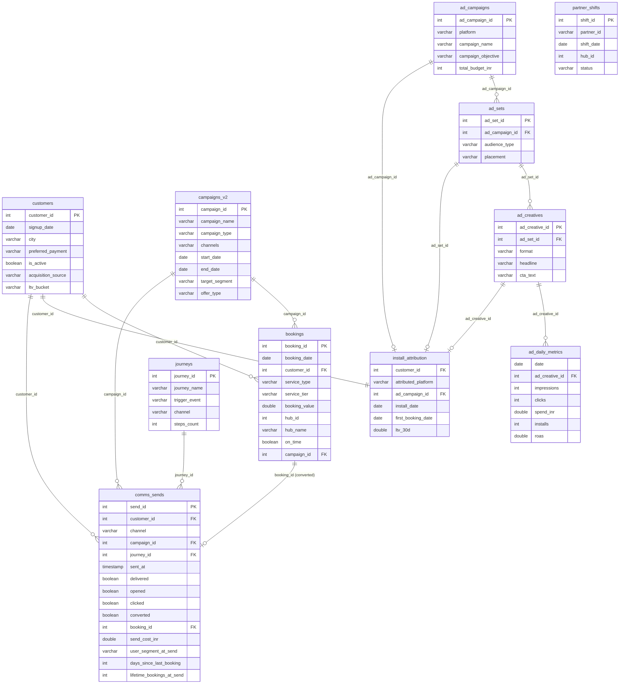

# feat: Extend Quick Help Dataset with Marketing & Comms Tables

## Overview

Extend the Quick Help dataset from an ops-only dataset to a full-company dataset covering CRM lifecycle marketing (push, SMS, email, WhatsApp, in-app) and performance marketing (Google Ads, Meta Ads). Regenerate all existing tables for a new date range (Feb 2025 – Feb 2026, 13 months). Add 8 new CSV tables, new denormalized views, new summary tables, and update the dataset config with expanded schema context and analysis agents.

## Problem Statement / Motivation

The current Quick Help dataset only covers operations (bookings, partner shifts, SLA tracking). This limits the types of questions users can ask — they cannot explore marketing ROI, CRM engagement, acquisition channels, LTV by source, or campaign performance. Extending the dataset makes Baby Sentinel a more compelling demo for growth teams, marketing teams, and executives who need cross-functional analytics.

## Proposed Solution

1. **Fully synthetic data generation** — New TypeScript script generates all 12 CSVs from scratch (no zomato_raw.csv dependency). Uses LLM-designed distribution parameters baked into the script as constants, with a seeded PRNG for reproducibility.
2. **Clean slate regeneration** — All tables regenerated for Feb 2025 – Feb 2026. Old CSVs archived to `data/csv/archive/`.
3. **8 new tables** — campaigns_v2, journeys, comms_sends, ad_campaigns, ad_sets, ad_creatives, ad_daily_metrics, install_attribution.
4. **Denormalized views** — Flat views for common query patterns (comms + campaigns, ad hierarchy + metrics).
5. **New summary tables** — Pre-materialized aggregations for marketing data.
6. **2 new analysis agents** — `crm-analytics` and `paid-marketing` added to the agent roster.
7. **Updated dataset config** — Full schema context, system context, domain hints, suggested prompts for marketing queries.

## Technical Approach

### Architecture Decisions

**D1. Fully synthetic generation (no zomato_raw.csv).** The current script derives hub/partner/geo patterns from Zomato Kaggle data. For the regenerated dataset, all distributions (hub locations, service types, partner pools) are defined as constants in the script. This removes the external dependency and gives full control over data patterns. *(see brainstorm: clean slate regeneration decision)*

**D2. campaigns.csv replaced by campaigns_v2.csv.** The old file is archived. All view SQL, summary tables, and schema context references update to campaigns_v2. The `campaign_type` enum changes from `discount/cashback/free_visit/referral` to `promo/seasonal/reactivation/referral/festival`. *(see brainstorm: "Both campaign + journey" decision)*

**D3. Two new agent IDs: `crm-analytics` and `paid-marketing`.** Rather than stuffing marketing queries into `rev-opt` or `user-segmentation`, new agents get dedicated IDs with clear labels in the research timeline UI. Requires adding to `VALID_IDS` in `schema-enricher.ts`. *(spec-flow gap Q3)*

**D4. SMS opened = true (assumed read).** SMS messages do not have open tracking, so `opened` is always `true` for delivered SMS. This keeps the column as a non-nullable boolean and satisfies the funnel constraint (opened ≤ delivered). *(spec-flow gap Q4)*

**D5. frequency_cap_hit = true means suppressed.** When `frequency_cap_hit=true`, the message was blocked: `delivered=false`, `opened=false`, `clicked=false`, `converted=false`. The `send_cost_inr` is 0 (never sent). *(spec-flow gap Q5)*

**D6. Last-touch attribution for conversions.** If a customer receives multiple messages and books, the most recent send before the booking gets `converted=true` and the `booking_id` FK. *(spec-flow gap Q9)*

**D7. Suppressed journey steps do not appear.** If a customer converts or unsubscribes after step 1 of a 3-step journey, steps 2 and 3 are not generated. *(spec-flow gap Q10)*

**D8. ltv_bucket assigned post-bookings.** Generation order: customers (without ltv_bucket) → bookings → compute actual LTV from bookings → backfill ltv_bucket on customers. *(spec-flow gap Q8)*

**D9. Pre-compute derived columns in CSVs.** `ctr`, `cpc_inr`, `cpi_inr`, `cpfb_inr`, `roas` in ad_daily_metrics are pre-computed for convenience. Division-by-zero cases (0 clicks → cpc=0, 0 installs → cpi=0) handled explicitly. *(spec-flow gap Q14)*

**D10. Built-in validation step.** The generation script runs all sanity rules after CSV generation and reports violations before writing files. *(spec-flow gap Q13)*

### Generation Order (Dependency Chain)

```
1. Constants & distributions (hubs, service catalog, partner pool)
2. customers.csv (without ltv_bucket)
3. ad_campaigns → ad_sets → ad_creatives (hierarchy, no customer dependency)
4. install_attribution (needs customers + ad hierarchy)
5. campaigns_v2.csv + journeys.csv (independent dimension tables)
6. bookings.csv (needs customers, campaigns_v2, partner pool)
7. Backfill: customers.ltv_bucket (computed from bookings)
8. Backfill: install_attribution.first_booking_date, ltv_7d/30d/90d (from bookings)
9. comms_sends.csv (needs everything above — biggest dependency fan-in)
10. partner_shifts.csv (derived from bookings partner data)
11. ad_daily_metrics.csv (needs ad_creatives + install_attribution for cross-referencing)
12. Validation pass (all 18 sanity rules)
13. Write CSVs to data/csv/
```

### New Denormalized Views

**`comms_full`** — comms_sends LEFT JOIN campaigns_v2 ON campaign_id LEFT JOIN journeys ON journey_id
- Adds: campaign_name, campaign_type, offer_type, target_segment, journey_name, trigger_event
- Use case: "What was the open rate for reactivation campaigns via WhatsApp?"

**`ad_full`** — ad_daily_metrics JOIN ad_creatives JOIN ad_sets JOIN ad_campaigns
- Adds: platform, campaign_name, campaign_objective, bid_strategy, audience_type, creative_name, format, headline, cta_text, service_featured
- Use case: "Which Meta video creatives had the best ROAS?"

**`attribution_full`** — install_attribution LEFT JOIN customers ON customer_id
- Adds: signup_date, city, preferred_payment, is_active, acquisition_source, ltv_bucket
- Use case: "What is the 30-day LTV for customers acquired via Google vs referral?"

### New Summary Tables

**`comms_channel_metrics`** — Aggregated by channel
- channel, total_sends, delivered, opened, clicked, converted, total_cost_inr, unsubscribed, avg_time_to_open_min

**`comms_campaign_metrics`** — Aggregated by campaign_id
- campaign_id, campaign_name, campaign_type, channel, sends, delivered, opened, clicked, converted, cost_inr, revenue_attributed_inr

**`journey_metrics`** — Aggregated by journey_id + step
- journey_id, journey_name, journey_step, sends, delivered, opened, clicked, converted, drop_off_rate

**`ad_platform_metrics`** — Aggregated by platform + month
- platform, month, total_spend_inr, impressions, clicks, installs, first_bookings, avg_cpi, avg_cpfb, roas

**`attribution_source_metrics`** — Aggregated by attributed_platform
- attributed_platform, total_customers, avg_days_to_first_booking, avg_ltv_7d, avg_ltv_30d, avg_ltv_90d, conversion_rate (install → first booking)

### Expanded Sanity Rules (18 total)

Original 10 from brainstorm, plus 8 new from spec-flow analysis:

11. `bookings.campaign_id` (when not null) must exist in `campaigns_v2.campaign_id`
12. `comms_sends.hub_id` must exist in the set of hub_ids from bookings
13. `partner_shifts.partner_id` must exist in the set of partner_ids from bookings
14. `install_attribution.referrer_customer_id` (when not null) must exist in `customers.customer_id`
15. `install_attribution.first_booking_date` must match the actual earliest booking in bookings.csv for that customer
16. `ad_daily_metrics.date` must fall within parent ad_campaign's start_date to end_date
17. `comms_sends.sent_at` date must fall within parent campaign's start_date to end_date (when campaign_id is not null)
18. Ad spend tolerance: `ad_daily_metrics` spend per campaign sums to within 5% of `ad_campaigns.total_budget_inr`

---

## Implementation Phases

### Phase 1: Data Generation Script (`scripts/generate-quickhelp-v2.ts`)

**Deliverables:**
- New TypeScript script that generates all 12 CSVs
- LLM-designed distribution parameters as typed constants
- Seeded PRNG (seed=42) for reproducibility
- Built-in validation of all 18 sanity rules
- Archive old CSVs to `data/csv/archive/`

**Tasks:**

1. **Define constants and distributions**
   - Hub definitions (5 hubs with lat/lng centroids, names, areas, city types)
   - Service catalog (18 types × 4 tiers with price ranges)
   - Partner pool (~500 partners with age/rating distributions)
   - Festival calendar for Feb 2025 – Feb 2026
   - Monthly volume multipliers (seasonal patterns from brainstorm)
   - CRM channel mix, funnel rates, cost per send (from brainstorm distribution tables)
   - Ad performance parameters (CPC, CTR, CPI ranges per platform)
   - Acquisition channel mix (organic 35%, google 25%, meta 20%, referral 15%, whatsapp 5%)

2. **Generate dimension tables**
   - `customers.csv` — 18K customers with signup_date distribution across 13 months, city assignment, preferred_payment, acquisition_source (from channel mix)
   - `campaigns_v2.csv` — ~50 campaigns spread across date range, aligned with festivals and seasonal patterns
   - `journeys.csv` — 15 lifecycle journeys (welcome, win-back, post-booking, rating nudge, etc.)
   - `ad_campaigns.csv` — ~30 campaigns (google + meta), aligned with seasonal spend patterns
   - `ad_sets.csv` — ~100 ad sets linked to campaigns, audience targeting
   - `ad_creatives.csv` — ~200 creatives linked to ad sets, various formats

3. **Generate install_attribution** (~18K rows)
   - One per customer, attributed_platform from acquisition mix
   - Paid customers get valid ad_campaign_id → ad_set_id → ad_creative_id FKs
   - Organic/referral/whatsapp get null ad FKs
   - Referral customers get referrer_customer_id (must be an earlier-signup customer)
   - install_date and signup_date (install ≤ signup, typically same day or +1)

4. **Generate bookings** (~300K rows)
   - Power-law customer booking frequency (most book 1-5x, whales book 50+)
   - Service type distribution weighted by season (deep cleaning up in summer)
   - Hub assignment based on customer location
   - Partner assignment from hub's partner pool
   - SLA timing: arrival_time_min with hub-specific mean + weather/traffic modifiers
   - Campaign attribution: 40% of bookings during active campaign get campaign_id
   - Payment method/status, rescheduling, partner reassignment flags
   - Planted anomalies: payment outage, festival surge, underperforming hubs

5. **Backfill computed columns**
   - `customers.ltv_bucket` — computed from actual booking sums (low: <₹500, medium: ₹500-2000, high: ₹2000-5000, whale: >₹5000)
   - `install_attribution.first_booking_date` — from bookings data
   - `install_attribution.ltv_7d/30d/90d` — sum of booking_value within windows after first_booking_date

6. **Generate comms_sends** (~800K rows)
   - Batch campaign sends: for each campaign, select target customers by segment, generate sends per channel
   - Journey sends: for each customer lifecycle event, trigger journey steps with delays
   - Funnel simulation: delivered → opened → clicked → converted with channel-specific rates
   - Conversion attribution: last-touch, 24h window, link booking_id
   - Audience context columns: compute days_since_last_booking and lifetime_bookings_at_send from actual booking timeline
   - Frequency cap: ~5% of sends are suppressed (frequency_cap_hit=true, all engagement=false)
   - A/B variants: ~30% of sends have ab_variant (A/B split), rest null
   - Unsubscribe: ~0.3% per batch, ~0.1% per journey

7. **Generate partner_shifts** (~250K rows)
   - Derived from bookings partner data
   - Shift hours, status distribution, bookings assigned vs completed

8. **Generate ad_daily_metrics** (~15K rows)
   - Daily rows per active creative within campaign date range
   - Impressions/clicks/spend from platform-specific distributions
   - installs and first_bookings cross-referenced with install_attribution
   - Pre-compute derived columns (ctr, cpc, cpi, cpfb, roas)

9. **Validation pass**
   - Run all 18 sanity rules
   - Report violations with counts and sample rows
   - Fail if any critical rule violated (rules 1-9, 11-17)
   - Warn if tolerance rule violated (rule 18: within 5%)

10. **Write CSVs**
    - Archive existing `data/csv/*.csv` to `data/csv/archive/`
    - Write all 12 CSVs to `data/csv/`
    - Print summary statistics

**Success criteria:**
- All 18 sanity rules pass
- Row counts within expected ranges
- CSV files are valid (no encoding issues, proper escaping)

### Phase 2: DuckDB Setup (`scripts/setup-quickhelp.ts`)

**Deliverables:**
- Updated setup script that creates views and summary tables for all 12 CSVs
- New denormalized views (comms_full, ad_full, attribution_full)
- 5 new summary tables for marketing data
- Updated required-files check

**Tasks:**

1. **Update required files list** — Add all 8 new CSVs, rename campaigns.csv → campaigns_v2.csv

2. **Create base views** for new CSVs:
   - `campaigns_v2` VIEW from campaigns_v2.csv
   - `journeys` VIEW from journeys.csv
   - `comms_sends` VIEW from comms_sends.csv
   - `ad_campaigns` VIEW from ad_campaigns.csv
   - `ad_sets` VIEW from ad_sets.csv
   - `ad_creatives` VIEW from ad_creatives.csv
   - `ad_daily_metrics` VIEW from ad_daily_metrics.csv
   - `install_attribution` VIEW from install_attribution.csv

3. **Update existing denormalized bookings view** — Change JOIN from campaigns.csv → campaigns_v2.csv, update column references for new campaign_type values

4. **Create new denormalized views:**
   - `comms_full` (comms_sends + campaigns_v2 + journeys)
   - `ad_full` (ad_daily_metrics + ad_creatives + ad_sets + ad_campaigns)
   - `attribution_full` (install_attribution + customers)

5. **Update existing summary tables** — Regenerate daily_metrics, campaign_metrics with new campaign_type values

6. **Create new summary tables:**
   - `comms_channel_metrics`
   - `comms_campaign_metrics`
   - `journey_metrics`
   - `ad_platform_metrics`
   - `attribution_source_metrics`

7. **Print summary** — Row counts for all tables and views

**Success criteria:**
- `npx tsx scripts/setup-quickhelp.ts` runs without errors
- All views and summary tables queryable
- Row counts match generated CSVs

### Phase 3: Dataset Config (`src/lib/datasets/quickhelp.ts`)

**Deliverables:**
- Updated viewSQL with all new views
- Updated summaryTableSQL with all new summary tables
- Expanded schemaContext covering all 12 tables + views + summary tables
- Updated systemContext, domainHints, summaryTableHint
- 2 new agents (crm-analytics, paid-marketing) in multiAgentPrompt and queryDescriptions
- Updated reportMeta, dateRange, suggestedPrompts, welcomeSubtitle

**Tasks:**

1. **Update viewSQL function** — Add all base views + denormalized views from Phase 2

2. **Update summaryTableSQL** — Add all new summary table CREATE statements

3. **Expand schemaContext** — Add documentation for:
   - New tables: campaigns_v2, journeys, comms_sends (with all columns)
   - New tables: ad_campaigns, ad_sets, ad_creatives, ad_daily_metrics, install_attribution
   - Denormalized views: comms_full, ad_full, attribution_full
   - New summary tables: comms_channel_metrics, comms_campaign_metrics, journey_metrics, ad_platform_metrics, attribution_source_metrics
   - Structure by domain sections (Operations, CRM/Lifecycle, Performance Marketing) to manage context length

4. **Update systemContext** — Add marketing analytics persona, mention CRM and ad data availability

5. **Update domainHints** — Add SQL tips for marketing tables:
   - "Use comms_full view for CRM queries (pre-joined with campaign and journey metadata)"
   - "Use ad_full view for ad performance queries (flattened hierarchy)"
   - "comms_sends.converted means booked within 24h of click (last-touch attribution)"
   - "SMS messages have opened=true (assumed read, no open tracking)"
   - "frequency_cap_hit=true means message was suppressed (not sent)"

6. **Update summaryTableHint** — Mention new summary tables and when to use them

7. **Add new agents to multiAgentPrompt:**
   - `crm-analytics` — CRM engagement, channel comparison, journey performance, send volume trends
   - `paid-marketing` — Ad spend efficiency, platform comparison, creative performance, CAC, ROAS

8. **Add queryDescriptions for new agents**

9. **Update reportMeta:**
   - totalEvents: "~300K bookings + 800K comms"
   - totalUsers: "~18K customers"
   - dateRangeLabel: "Feb 2025 – Feb 2026"

10. **Update dateRange:** `{ start: "2025-02-01", end: "2026-02-28" }`

11. **Add marketing-focused suggestedPrompts:**
    - "What is the conversion rate by CRM channel (push vs WhatsApp vs email)?"
    - "Compare Google vs Meta ad performance by cost per first booking"
    - "Which lifecycle journeys have the highest conversion rate?"
    - "Show monthly marketing spend vs new customer acquisition"
    - "What is the 30-day LTV by acquisition source?"
    - "Which campaign had the best ROI last month?"

12. **Update welcomeSubtitle:** "Analyze service bookings, partner performance, marketing campaigns, CRM engagement, and ad spend across channels and hubs."

**Success criteria:**
- `pnpm build` succeeds
- LLM can generate valid SQL for marketing queries
- Research timeline shows 8 agents (6 existing + 2 new)

### Phase 4: Agent ID Registration

**Deliverables:**
- `crm-analytics` and `paid-marketing` added to VALID_IDS
- Timeline UI renders new agent cards correctly

**Tasks:**

1. **Update `src/lib/datasets/schema-enricher.ts`** — Add `crm-analytics` and `paid-marketing` to VALID_IDS Set

2. **Verify timeline UI** — Ensure `src/components/chat/` agent card components handle new IDs without hardcoded assumptions (they should, since IDs are dynamic)

3. **Update any agent-specific styling/icons** if the UI uses agent ID → icon mappings

**Success criteria:**
- Schema enricher accepts new agent IDs
- Timeline renders agent cards for all 8 agents
- No console errors or missing UI elements

---

## System-Wide Impact

### Interaction Graph

- Data generation script → writes CSVs → setup script reads CSVs → creates DuckDB → runtime db.ts reads DuckDB
- `quickhelp.ts` config → `schema.ts` → `prompts/sql.ts` → `sql-generator.ts` → LLM generates SQL → `sql-executor.ts` runs against DuckDB
- New agent IDs → `schema-enricher.ts` VALID_IDS → `sql-generator.ts` getAgentSpecs() → analyze API → timeline UI

### Error Propagation

- If generation script produces inconsistent data → DuckDB views may fail silently (NULLs from broken JOINs) → LLM gets wrong query results → bad analysis
- If schemaContext is too large → Gemini may truncate or hallucinate column names → SQL generation errors
- If new agent IDs not added to VALID_IDS → schema enrichment silently drops marketing agents → no marketing analysis in deep mode

### State Lifecycle Risks

- Old quickhelp.duckdb must be deleted before running new setup (stale summary tables from old schema)
- If generation fails mid-run, partial CSVs in data/csv/ will break the setup script → archive step should be atomic (archive all or none)

### API Surface Parity

- No API route changes needed — all routes are dataset-agnostic
- The `x-dataset-id: quickhelp` header continues to work unchanged
- Board generation and research-to-board flows should work with marketing data (chart inference handles generic metrics)

---

## Acceptance Criteria

### Functional Requirements

- [ ] All 12 CSVs generated with correct schemas and row counts
- [ ] All 18 sanity rules pass validation
- [ ] `npx tsx scripts/setup-quickhelp.ts` runs without errors
- [ ] DuckDB contains all views and summary tables
- [ ] LLM generates valid SQL for marketing queries (test with suggested prompts)
- [ ] Deep research mode runs 8 agents (6 ops + 2 marketing)
- [ ] Research timeline renders all 8 agent cards

### Non-Functional Requirements

- [ ] Generation script runs in < 5 minutes
- [ ] Setup script runs in < 30 seconds
- [ ] DuckDB file size < 10 MB
- [ ] schemaContext fits within Gemini's effective context for SQL generation

### Quality Gates

- [ ] `pnpm build` succeeds
- [ ] `pnpm lint` passes
- [ ] All suggested prompts produce valid SQL and meaningful analysis

---

## Dependencies & Risks

| Risk | Likelihood | Impact | Mitigation |
|------|-----------|--------|------------|
| schemaContext too large for effective SQL generation | Medium | High | Structure by domain sections, test with Gemini, compress if needed |
| 800K comms_sends generation is slow | Low | Medium | Batch generation, pre-sort customer bookings for O(n) lookups |
| Temporal consistency bugs in comms_sends | High | High | Sort bookings by customer+date first, use binary search for lookups |
| campaign_type enum change breaks existing queries | Low | Low | Clean slate — no backward compatibility needed |
| New agent IDs break UI assumptions | Low | Low | UI uses dynamic agent lists, no hardcoded ID checks |

---

## ERD



---

## Sources & References

### Origin

- **Brainstorm document:** [docs/brainstorms/2026-03-13-quickhelp-marketing-dataset-extension-brainstorm.md](../brainstorms/2026-03-13-quickhelp-marketing-dataset-extension-brainstorm.md)
  - Key decisions carried forward: clean slate regeneration, campaign + journey dual model, full ad hierarchy, LLM-assisted generation, all distribution parameters

### Internal References

- Existing generation script: `scripts/generate-quickhelp-data.ts` — pattern for toCsv(), seeded PRNG, anomaly planting
- Dataset config: `src/lib/datasets/quickhelp.ts` — viewSQL, summaryTableSQL, schemaContext structure
- Setup script: `scripts/setup-quickhelp.ts` — view and summary table creation pattern
- DB singleton: `src/lib/db.ts` — ensureDatasetReady flow, withConnection pattern
- Agent validation: `src/lib/datasets/schema-enricher.ts` — VALID_IDS set
- Dataset types: `src/lib/datasets/types.ts` — DatasetConfig interface

### Institutional Learnings

- DuckDB connection leak crashes: always use singleton pattern, delete corrupted .duckdb/.wal files if segfaults occur (`docs/solutions/database-issues/duckdb-connection-leak-server-crash-System-20260219.md`)
- Railway ephemeral filesystem: static datasets unaffected, dynamic datasets need Volume mount (`docs/solutions/best-practices/railway-ephemeral-filesystem-dynamic-datasets-Deployment-20260223.md`)
