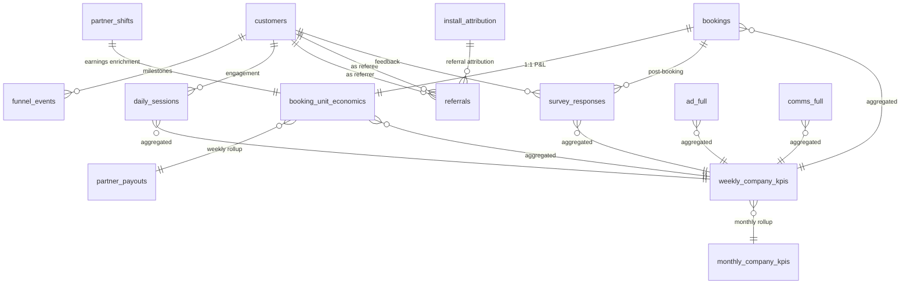

# feat: Extend Quick Help dataset with Growth, Unit Economics & Company KPIs

## Overview

Extend the Quick Help dataset from ops + marketing comms to a **fully holistic company dataset** covering Growth/Acquisition (AARRR funnel), Unit Economics (per-booking P&L), and Company KPIs (board-level snapshots grounded in real data). This adds 6 new CSV tables, 2 materialized KPI views, enriches `partner_shifts` with earnings columns, and registers 2 new analysis agents.

(see brainstorm: docs/brainstorms/2026-03-15-quickhelp-growth-kpi-unit-economics-brainstorm.md)

## Problem Statement

Quick Help currently covers operations and marketing comms but lacks:
- **Growth funnel visibility** — no way to ask "what's the signup-to-first-booking conversion rate?" or "show me weekly retention cohorts"
- **Unit economics** — no per-booking P&L, can't analyze contribution margin by service type or city
- **Company-level KPIs** — no board-level view of GMV, CAC, LTV:CAC, burn rate, NPS

These are the metrics every Series A/B hyperlocal startup (Urban Company, Swiggy, Dunzo) tracks daily.

## Proposed Solution

Add 8 new data artifacts (6 CSV tables + 2 materialized views) + enrich `partner_shifts`. Register 2 new LLM agents (`growth-analytics`, `unit-economics`). All KPI snapshots are SQL aggregations over real data — never independently fabricated.

---

## Architecture Decisions

### D1: PRNG Seed Strategy — Separate seed for new tables

New table generation uses a forked seed (`_seed = 4242`) AFTER all existing generation steps complete. This preserves determinism for the existing 11 tables (bookings, comms_sends, etc. remain identical). New tables are deterministic independently.

**Why:** Inserting generators mid-stream changes PRNG state for all downstream tables, breaking the planted anomalies and existing data patterns.

### D2: Generation Order — Append after existing Step 9

```
Existing Steps 1-9 (UNCHANGED — same seed, same data)
Fork seed to 4242
Step 10: booking_unit_economics (from filteredBookings)
Step 11: partner_payouts (from booking_unit_economics, grouped by partner + ISO week)
Step 12: Enrich partner_shifts with earnings columns
Step 13: funnel_events (from customers + booking history)
Step 14: daily_sessions (from customers + booking dates)
Step 15: referrals (from attributions where platform='referral')
Step 16: survey_responses (from successful bookings)
Step 17: Validation (existing rules 1-18 + new rules 19-34)
Step 18: Write all CSVs (existing 11 + new 6)
```

### D3: booking_unit_economics includes ALL bookings

Every booking gets a row, including `payment_status = 'failed'` and `'refunded'`. For failed bookings: commission=0, partner_payout=0. For refunded: partner_payout is partial (partner did the work), contribution_margin is negative. This maintains 1:1 cardinality with bookings and avoids confusing the LLM with missing rows.

### D4: Referrals include unconverted attempts

~3K total rows: ~2,700 converted (matching install_attribution referral customers) + ~300 unconverted (invited but never signed up). `status` column distinguishes them. Enables referral program health analysis.

### D5: Survey responses are scores only (no verbatim text)

DuckDB can't do text analytics. Adding generated free text would waste space and confuse the LLM. Survey types: `nps` (score 0-10), `csat` (score 1-5), `post_booking` (score 1-5). Category column for what aspect was rated.

### D6: KPI views are grounded SQL — not CSVs

`weekly_company_kpis` and `monthly_company_kpis` are created as materialized tables in `setup-quickhelp.ts` via SQL aggregating real data. No CSV generation needed. This guarantees cross-table consistency.

### D7: New denormalized views

- `bookings_economics` — bookings + booking_unit_economics (1:1 join)
- `survey_full` — survey_responses + bookings core columns
- `referrals_full` — referrals + customer info for both referrer and referee

### D8: Two new agents — `growth-analytics` and `unit-economics`

Following the marketing extension pattern. Registered in `schema-enricher.ts` VALID_IDS and configured in `quickhelp.ts` multiAgentPrompt.

### D9: partner_shifts earnings computed from bookings directly

During generation, `earnings_gross` is computed by summing `booking_value * (1 - commission_rate)` for completed bookings in that shift. Cross-validated against `booking_unit_economics` in the validation step. No circular dependency.

### D10: daily_sessions activity model — power-law distribution

Not every customer has a session every day. Active users: 2-4 sessions/month. Booking days always have a session (`booked=true`). Session frequency decays for churning customers. Only generated from `signup_date` to either last booking + 30 days or end of range.

---

## Complete Table Schemas

### `funnel_events.csv` (~100K rows)

```
event_id         INT       PK
customer_id      INT       FK → customers
event_type       VARCHAR   signup_complete | profile_done | address_added | payment_added |
                           first_browse | first_booking | second_booking_14d |
                           third_booking_30d | referral_sent
event_at         TIMESTAMP when milestone was reached
days_since_signup INT      days from signup to this event
source           VARCHAR   organic | push_notification | email_deeplink | whatsapp_link | ad_click
city             VARCHAR   customer's city at time of event
platform         VARCHAR   android | ios | web
```

One row per milestone REACHED (variable rows per customer, 1-9). Timestamps strictly increasing per customer.

Funnel conversion rates:
- signup_complete: 100% → profile_done: 85% → address_added: 70% → payment_added: 60%
- first_browse: 50% → first_booking: 83% → second_booking_14d: 46% of first-bookers
- third_booking_30d: 29% of first-bookers → referral_sent: 15%

### `daily_sessions.csv` (~500K rows)

```
customer_id    INT       FK → customers
session_date   DATE
session_count  INT       app opens that day (1-5)
screens_viewed INT       total screens viewed (3-15)
minutes_active DOUBLE    total active time (1-12)
searched       BOOLEAN   searched for a service
booked         BOOLEAN   made a booking (must match bookings table)
viewed_offers  BOOLEAN   viewed promotions/offers
platform       VARCHAR   android | ios | web
```

Composite key: (customer_id, session_date). Generated only for dates ≥ customer signup_date. Platform split: 65% Android, 30% iOS, 5% web.

### `referrals.csv` (~3K rows)

```
referral_id           INT       PK
referrer_customer_id  INT       FK → customers (who sent invite)
referee_customer_id   INT       nullable FK → customers (who signed up, null if unconverted)
referral_code         VARCHAR   e.g., "QUICK-ABC123"
invited_at            TIMESTAMP when invite was sent
signup_at             TIMESTAMP nullable (when referee signed up)
first_booking_at      TIMESTAMP nullable (when referee made first booking)
days_to_signup        INT       nullable
days_to_first_booking INT       nullable
referrer_reward_amount DOUBLE   ₹100-200
referee_reward_amount  DOUBLE   ₹150-250
reward_status         VARCHAR   pending | credited | expired
referral_channel      VARCHAR   whatsapp | sms | link_copy | email
status                VARCHAR   converted | unconverted
```

### `booking_unit_economics.csv` (~206K rows, 1:1 with bookings)

```
booking_id              INT     PK/FK → bookings
booking_date            DATE    denormalized for easy grouping
service_type            VARCHAR denormalized
service_tier            VARCHAR denormalized
payment_status          VARCHAR denormalized
payment_method          VARCHAR denormalized
gross_booking_value     DOUBLE  = bookings.booking_value (exact match, Rule #26)
commission_rate         DOUBLE  0.25-0.32 (varies by service_tier)
commission_earned       DOUBLE  gross × commission_rate (0 if failed)
partner_payout          DOUBLE  gross - commission (0 if failed, partial if refunded)
payment_processing_fee  DOUBLE  0% UPI, 1.8% card, 1.5% wallet, ₹5 cash handling
gst_on_commission       DOUBLE  18% of commission_earned
promo_discount_funded   DOUBLE  platform-funded discount (0 if no campaign)
referral_reward_cost    DOUBLE  allocated referral cost (0 if not referral booking)
support_cost_allocated  DOUBLE  ₹5-15 per booking (higher for rescheduled)
contribution_margin     DOUBLE  commission - processing - promo - referral - support
contribution_margin_pct DOUBLE  contribution_margin / gross_booking_value
```

Commission rate tiers:
- Premium: 30-32%, Quick: 25-27%, Standard: 27-29%, Extended: 28-30%

### `partner_payouts.csv` (~26K rows)

```
payout_id          INT     PK
partner_id         INT     FK
payout_week_start  DATE    Monday (ISO week)
payout_week_end    DATE    Sunday
gross_earnings     DOUBLE  sum of partner_payout from booking_unit_economics
commission_deducted DOUBLE sum of commission_earned
incentive_bonus    DOUBLE  ₹0-500 (>4.5 rating or >95% on-time)
penalty_deductions DOUBLE  ₹0-200 (late arrivals, cancellations)
net_payout         DOUBLE  gross - commission + incentive - penalty
bookings_completed INT     count of completed bookings
avg_rating         DOUBLE  average customer rating for the week
payout_status      VARCHAR processed | pending | on_hold
payout_date        DATE    Wednesday after week end (T+3)
```

### `survey_responses.csv` (~60K rows)

```
response_id           INT       PK
customer_id           INT       FK → customers
booking_id            INT       FK → bookings (payment_status='success' only)
partner_id            INT       FK (denormalized from booking)
survey_type           VARCHAR   nps | csat | post_booking
score                 INT       NPS: 0-10, CSAT/post_booking: 1-5
category              VARCHAR   nullable — service_quality | punctuality | value_for_money |
                                partner_behavior | app_experience
submitted_at          TIMESTAMP after booking completion
time_to_respond_hours DOUBLE    hours between booking and response
```

Survey distribution: 60% post_booking, 25% NPS, 15% targeted. Response rate: ~30% of successful bookings. NPS distribution: Promoters 45%, Passives 30%, Detractors 25% → blended NPS ~20.

### `partner_shifts` enrichment — 4 new columns

```
earnings_gross   DOUBLE  sum of booking payouts for completed bookings in shift
commission_rate  DOUBLE  platform take rate applied (0.25-0.32)
incentive_earned DOUBLE  shift-level bonus (surge, completion, rating)
net_earnings     DOUBLE  earnings_gross × (1 - commission_rate) + incentive_earned
```

For `no_show`/`cancelled` shifts: all earnings = 0.

### `weekly_company_kpis` (materialized table, ~56 rows)

Computed via SQL in `setup-quickhelp.ts`. NOT a CSV.

```
week_start               DATE    Monday of ISO week
gmv                      DOUBLE  SUM(bookings.booking_value)
revenue                  DOUBLE  SUM(booking_unit_economics.commission_earned)
take_rate                DOUBLE  revenue / gmv
total_bookings           INT     COUNT(bookings)
completed_bookings       INT     COUNT(WHERE payment_status='success')
completion_rate          DOUBLE  completed / total
unique_customers         INT     COUNT(DISTINCT customer_id) from bookings
new_customers            INT     COUNT(WHERE is_first_booking)
repeat_customers         INT     unique - new
repeat_rate              DOUBLE  repeat / unique
dau_avg                  DOUBLE  AVG(daily unique users from daily_sessions)
wau                      INT     COUNT(DISTINCT customer_id) from daily_sessions for week
active_partners          INT     COUNT(DISTINCT partner_id) from partner_shifts WHERE status='completed'
avg_partner_rating       DOUBLE  AVG(bookings.partner_rating)
on_time_pct              DOUBLE  AVG(bookings.on_time) × 100
avg_arrival_min          DOUBLE  AVG(bookings.arrival_time_min)
nps_score                DOUBLE  (promoters - detractors) / total × 100 from survey_responses
csat_avg                 DOUBLE  AVG(survey_responses.score WHERE type='csat')
total_ad_spend           DOUBLE  SUM(ad_full.spend_inr)
total_comms_cost         DOUBLE  SUM(comms_full.send_cost_inr)
total_referral_rewards   DOUBLE  SUM(referrals.referrer_reward_amount + referee_reward_amount WHERE credited)
blended_cac              DOUBLE  (ad_spend + comms_cost + referral_rewards) / new_customers
contribution_margin_total DOUBLE SUM(booking_unit_economics.contribution_margin)
contribution_margin_pct  DOUBLE  contribution_margin_total / gmv
partner_payout_total     DOUBLE  SUM(partner_payouts.net_payout)
gross_burn               DOUBLE  ad_spend + comms_cost + referral_rewards + partner_incentives + support_costs
```

### `monthly_company_kpis` (materialized table, ~13 rows)

Same as weekly aggregated to calendar months, plus:

```
month                    DATE    DATE_TRUNC('month')
ltv_30d_avg              DOUBLE  AVG(install_attribution.ltv_30d) for cohort
ltv_cac_ratio            DOUBLE  ltv_30d_avg / blended_cac
partner_churn_rate       DOUBLE  partners with 0 shifts / active last month
customer_churn_rate      DOUBLE  customers with 0 bookings / active last month
referral_k_factor        DOUBLE  new referral signups / active referrers
activation_rate          DOUBLE  first_booking customers / signups this month
signup_to_book_days_avg  DOUBLE  AVG days from signup to first booking
```

---

## Data Sanity Rules (#19-34)

19. Every `funnel_events.customer_id` exists in customers.csv
20. Funnel milestone timestamps strictly increasing per customer (signup < profile < address < payment < browse < first_booking)
21. `funnel_events` WHERE event_type='first_booking' → `event_at` date matches `install_attribution.first_booking_date`
22. `daily_sessions.booked=true` days match dates where customer has booking in bookings.csv
23. `daily_sessions` only exist for dates ≥ customer's signup_date
24. `referrals.referee_customer_id` (WHERE status='converted') matches customers with `install_attribution.attributed_platform='referral'`
25. `referrals.referrer_customer_id` matches customers who have `referral_sent` in funnel_events
26. `booking_unit_economics.gross_booking_value` = `bookings.booking_value` (exact match)
27. `contribution_margin` = commission_earned - payment_processing_fee - promo_discount_funded - referral_reward_cost - support_cost_allocated (arithmetic)
28. `partner_payouts.gross_earnings` = SUM(booking_unit_economics.partner_payout) for same partner+week
29. `partner_payouts.bookings_completed` = COUNT of completed bookings for same partner+week
30. `survey_responses.booking_id` exists in bookings with payment_status='success'
31. `survey_responses.submitted_at` > booking completion time (arrived_at + service_duration_min)
32. NPS scores 0-10, CSAT/post_booking scores 1-5
33. `weekly_company_kpis.gmv` = SUM(bookings.booking_value) for that week
34. `weekly_company_kpis.revenue` = SUM(booking_unit_economics.commission_earned) for that week

---

## ERD



---

## Implementation Phases

### Phase 1: Data Generation (`scripts/generate-quickhelp-v2.ts`)

- [x] Add `booking_unit_economics` generation after filteredBookings (Step 10)
  - Commission rate by service_tier
  - Payment processing fee by payment_method (UPI=0%, card=1.8%, wallet=1.5%, cash=₹5)
  - Promo discount from campaign discount_pct
  - Support cost: ₹5 base + ₹5 if rescheduled + ₹5 if partner_reassigned
  - Contribution margin arithmetic
- [ ] Add `partner_payouts` generation (Step 11)
  - Group booking_unit_economics by partner_id + ISO week
  - Calculate incentive bonus (>4.5 rating or >95% on-time → ₹100-500)
  - Calculate penalty (late arrivals → ₹50-200)
  - Payout status: 98% processed, 2% on_hold
- [ ] Enrich `partner_shifts` with earnings columns (Step 12)
  - Sum booking payouts for completed bookings in each shift
  - Apply commission rate and incentive logic
- [ ] Add `funnel_events` generation (Step 13)
  - For each customer, generate milestones based on their booking history
  - Align first_booking event_at with install_attribution.first_booking_date
  - Apply conversion rates from brainstorm
- [ ] Add `daily_sessions` generation (Step 14)
  - Power-law activity model
  - Booking days always have session with booked=true
  - Session frequency decays for churning customers
  - Seasonal patterns (festival spikes, monsoon dip)
- [ ] Add `referrals` generation (Step 15)
  - Source from install_attribution WHERE attributed_platform='referral'
  - Generate ~300 unconverted referral attempts
  - WhatsApp dominant channel (60%)
- [ ] Add `survey_responses` generation (Step 16)
  - 30% response rate on successful bookings
  - NPS distribution: promoters 45%, passives 30%, detractors 25%
  - CSAT correlated with partner_rating on same booking
- [ ] Add validation rules 19-34 (Step 17)
- [ ] Write 6 new CSV files (Step 18)
- [ ] Fork PRNG seed to 4242 before Step 10

### Phase 2: DuckDB Setup (`scripts/setup-quickhelp.ts`)

- [ ] Add 6 new CSV files to `required` array
- [ ] Add 6 new base views (raw_funnel_events, raw_daily_sessions, raw_referrals, raw_booking_unit_economics, raw_partner_payouts, raw_survey_responses)
- [ ] Add 3 new denormalized views:
  - `bookings_economics` = bookings + booking_unit_economics
  - `survey_full` = survey_responses + bookings core columns
  - `referrals_full` = referrals + customer info for referrer and referee
- [ ] Add growth summary tables:
  - `funnel_conversion_metrics` — conversion rates between stages
  - `weekly_retention_cohorts` — cohort retention matrix
  - `activation_metrics` — monthly activation rates
- [ ] Add finance summary tables:
  - `service_unit_economics` — contribution margin by service_type × service_tier
  - `monthly_partner_economics` — partner earnings, utilization, churn
- [ ] Add KPI materialized tables:
  - `weekly_company_kpis` — ~56 rows, computed from all data
  - `monthly_company_kpis` — ~13 rows, with LTV:CAC, churn rates

### Phase 3: Dataset Config (`src/lib/datasets/quickhelp.ts`)

- [ ] Update `schemaContext` with 3 new domain sections:
  - Growth / Acquisition (funnel_events, daily_sessions, referrals)
  - Unit Economics / Finance (bookings_economics view, partner_payouts)
  - Company KPIs (weekly_company_kpis, monthly_company_kpis, survey_full)
- [ ] Add domain hints (#18-25) for new tables
- [ ] Add `queryDescriptions` for `growth-analytics` and `unit-economics` agents
- [ ] Add 6 new query tasks to `multiAgentPrompt` (3 growth + 3 unit-economics)
- [ ] Add new suggested prompts (growth + finance)
- [ ] Update `summaryTableHint` with new summary tables
- [ ] Update `reportMeta` with new counts
- [ ] Update `viewSQL` with 6 new base views + 3 denormalized views
- [ ] Update `summaryTableSQL` with all new summary + KPI tables

### Phase 4: Agent Registration (`src/lib/datasets/schema-enricher.ts`)

- [ ] Add `growth-analytics` and `unit-economics` to VALID_IDS Set

### Phase 5: Verify End-to-End

- [ ] Run `npx tsx scripts/generate-quickhelp-v2.ts` — all 34 validation rules pass
- [ ] Run `npx tsx scripts/setup-quickhelp.ts` — all views + tables created
- [ ] Run `pnpm build` — no TypeScript errors
- [ ] Run `pnpm lint` — no new lint errors
- [ ] Spot-check: query "what's the signup to first booking conversion rate?" via the app

---

## Acceptance Criteria

### Functional Requirements

- [ ] 6 new CSV files generated with correct schemas and row counts
- [ ] All 34 sanity rules pass (18 existing + 16 new)
- [ ] Existing 11 tables remain IDENTICAL (same seed, same data)
- [ ] 3 denormalized views queryable (bookings_economics, survey_full, referrals_full)
- [ ] weekly_company_kpis.gmv exactly equals SUM(bookings.booking_value) per week
- [ ] NPS score in KPIs matches computation from survey_responses
- [ ] partner_payouts aggregates match booking_unit_economics per partner per week
- [ ] LLM can answer growth questions ("what's the funnel drop-off?")
- [ ] LLM can answer unit economics questions ("contribution margin by service type?")
- [ ] LLM can answer company KPI questions ("what's our LTV:CAC ratio?")

### Quality Gates

- [ ] `pnpm build` passes
- [ ] `pnpm lint` passes (no new errors from our changes)
- [ ] Generation script runs in < 60 seconds
- [ ] All cross-table FK references valid

---

## Sources & References

### Origin

- **Brainstorm document:** [docs/brainstorms/2026-03-15-quickhelp-growth-kpi-unit-economics-brainstorm.md](docs/brainstorms/2026-03-15-quickhelp-growth-kpi-unit-economics-brainstorm.md) — Key decisions: milestones + daily sessions (not raw events), full per-booking P&L, grounded KPI views, separate referrals table, per-shift + weekly partner payouts

### Internal References

- Previous extension: `docs/plans/2026-03-13-feat-quickhelp-marketing-dataset-extension-plan.md`
- Generation script pattern: `scripts/generate-quickhelp-v2.ts`
- Setup script pattern: `scripts/setup-quickhelp.ts`
- Dataset config pattern: `src/lib/datasets/quickhelp.ts`
- Agent registration: `src/lib/datasets/schema-enricher.ts:95`

### External References

- [Urban Company FY24 Annual Report](https://investorrelations.urbancompany.com/announcements-and-highlights/annual-business-summary-fy2024) — unit economics benchmarks (28% take rate, 19.5% contribution margin)
- [AARRR Pirate Metrics Framework](https://www.productcompass.pm/p/aarrr-pirate-metrics) — growth funnel structure
- [Quick Commerce Unit Economics](https://thethoughtfultangle.substack.com/p/insight-unit-economics-and-profitability) — per-order P&L waterfall patterns
