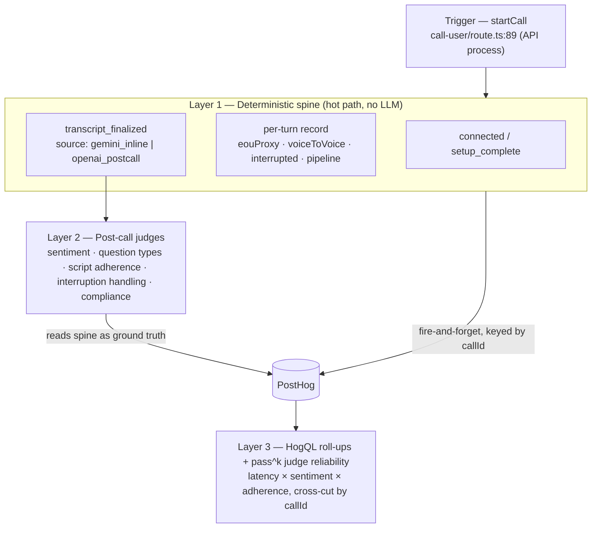

# Voice E2E Observability - Plan

## Goal Capsule

- **Objective:** Measure every production voice call end-to-end — from the moment it is triggered to the moment its transcript is final — and analyze call quality (latency, sentiment, question types, script adherence, interruption handling) in one unified surface.
- **Product authority:** Sashank (product decisions, KPI definitions, scope).
- **Open blockers:** Both pre-planning blockers are now resolved (see Planning Contract → Resolved Blockers). Layer 2 enrichment runs on **every call behind an env rate knob** (`VOICE_ENRICHMENT_SAMPLE_RATE`, default `1.0`); the PostHog event taxonomy is **signed off as flat snake_case** with `call_id` = `$ai_trace_id`.

---

## Product Contract

### Summary

Instrument the Plivo ⇄ Gemini Live voice pipeline (and its fallback bridges) with a single correlation id — the existing `callId` — so that a deterministic latency spine, a post-call qualitative analysis pass, and their aggregation all land in PostHog, joined per call. The primary number is per-turn voice-to-voice latency; the secondary is trigger→final-transcript. On top of that spine, LLM judges score sentiment, question types, script adherence, and interruption handling — using the spine's deterministic events as ground truth rather than re-detecting them from text.

### Problem Frame

We are moving a production telephony agent toward Decagon/Sierra-tier quality, but there is no aggregated latency metric anywhere: only per-event `console.log` deltas against a single `connectedAt`, and the one latency chart in the analytics UI is partly fabricated with `Math.sin` waves (`src/lib/voice-campaign-analysis.ts` `buildFallbackSimulationLatency`). We cannot produce a p50/p95/p99 voice-to-voice number, and we cannot correlate slow turns with call outcomes.

The qualitative side is half-built and disconnected: sentiment is a single coarse value per call (`src/lib/voice-campaign-types.ts` `VoiceCallAnalysis`); a six-check script-adherence rubric (`src/lib/voice-campaign-analysis.ts` `SCRIPT_ADHERENCE_CHECKS`) already scores *live* calls (`evaluateScriptAdherenceCall:516`, invoked from the call-logs and overview panels) but its score is never emitted to a shared analytics surface, so it cannot be cross-cut against latency; and the compliance judge scores a timeout as "no violations." None of it is keyed to latency or to a shared analytics surface, so no one can ask whether slow turns cause bad calls. This plan makes the whole call — timing and quality — measurable and cross-cuttable in one place.

### Key Decisions

- **One id spans the whole call: the existing `callId`.** It is minted before dial (`src/app/api/voice-campaigns/[id]/call-user/route.ts:89`), embedded in the Plivo stream URL, and read back by the bridge (`callIdFromRequest`, `src/lib/plivo-gemini-live-bridge.ts:504`), which persists the transcript under it. No new `speech_id` is invented — `speechId` is just `` `${callId}:${turnIndex}` ``.
- **PostHog is the sink and the aggregator.** PostHog already runs server-side for LLM observability (`src/lib/posthog-server.ts` `captureLLMGeneration`). Emitting voice events there deletes the need for a bespoke ring buffer, percentile function, and dashboard route, and unifies voice metrics with existing analytics. Percentiles and roll-ups are computed in HogQL, not in app code.
- **The bridge emits fire-and-forget.** The existing `captureEvent` awaits `ph.flush()` per call (`src/lib/posthog-server.ts:80`, client configured `flushAt:1`) and calls Clerk `auth()` for a distinct id — both illegal in the audio hot path. Voice uses a non-awaiting variant with an explicit `distinctId`, and the greppable `console.log("[voice/latency] …")` line stays as the always-on local sink (fail-open when no PostHog key).
- **Primary KPI is per-turn voice-to-voice; trigger→transcript is secondary.** The two are never blended into one figure. Voice-to-voice drives turn-taking/barge-in work; trigger→transcript drives downstream data-availability.
- **End-of-utterance is a labeled proxy, not a fabricated exact value.** Gemini owns VAD server-side and never sends an explicit "user stopped" event; the bridge only sees the model start replying. EOU is stamped as the last inbound **speech** frame before the model turn — **not** the last raw frame, because Plivo streams continuous 20 ms frames through silence (a raw-frame proxy would collapse `detection_think_ms` to ~0 and understate the primary KPI; see KTD4). It is tagged `eouSource: "gemini_vad_proxy"`, so the number honestly includes Gemini's ≥650 ms silence window and shrinks when own-VAD lands. Because that silence window is a fixed constant this plan does not touch, `response_lag_ms` is the component the team can actually move — track it alongside the headline number.
- **Coverage is schema-parity across all three bridges; live e2e on the two routed ones.** Gemini Live is primary; the OpenAI-Realtime and (dormant) Sarvam fallback bridges emit the same record schema. Only the two routed bridges are end-to-end verifiable on live calls (see Assumptions A-R7). This reverses the earlier "don't touch the fallback bridge" boundary.
- **The deterministic spine de-risks the LLM judges.** Layer 2 judges never re-detect interruptions or timings from flat text; they read the spine's `interrupted` flag and timestamps as ground truth and judge only quality.



### Requirements

**Layer 1 — Deterministic event spine**

- R1. Every call emits four lifecycle events keyed by `callId`: triggered (API process), WS-connected, setup-complete (with a prewarmed flag), and transcript-finalized (with `transcriptSource` of `gemini_inline` or `openai_postcall`).
- R2. Every completed user→assistant turn emits one record carrying `speechId`, `callId`, `turnIndex`, `eouProxyMs`, `voiceToVoiceMs`, `totalTurnMs`, `interrupted`, and `pipeline`.
- R3. `voiceToVoiceMs` is `firstAudioOut − eouProxy`, where `eouProxy` is the last inbound user frame before the model turn and is labeled `eouSource: "gemini_vad_proxy"`. The record also carries the derived split `detectionThinkMs` (`modelStart − eouProxy`) and `responseLagMs` (`firstAudioOut − modelStart`).
- R4. `interrupted` is set from the bridge's deterministic barge-in events (`src/lib/plivo-gemini-live-bridge.ts:1297` `gemini.model_audio_interrupted`, `serverContent.interrupted` at `:1934`), never inferred later from text.
- R5. Emission is off by default behind an env flag and fails open: when PostHog is unconfigured the `console.log("[voice/latency] …")` line still emits, and when the flag is off nothing emits.

**Layer 1 — Hot-path safety**

- R6. No emission call in the audio path awaits a network flush, resolves a distinct id via Clerk `auth()`, or touches pump pacing, thresholds, or audio routing. The change is additive: new locals plus fire-and-forget emits.
- R7. All three bridges (`plivo-gemini-live-bridge.ts`, the OpenAI-Realtime path, the Sarvam cascaded path) emit the same record schema; pipeline-specific fields absent on a given bridge are null, not omitted.

**Layer 2 — Post-call qualitative enrichment**

- R8. After hangup, one enrichment pass per call produces a structured, `callId`-keyed record covering sentiment trajectory, user question/intent types, script-adherence scores, interruption-handling quality, and compliance violations, and emits it to PostHog.
- R9. Script adherence reuses the existing six checks (`SCRIPT_ADHERENCE_CHECKS`) and scores them on live calls, not only simulated ones.
- R10. Sentiment is derived from the transcript text and reported as a per-turn trajectory (where sentiment turned), superseding the current single coarse per-call value.
- R11. The interruption-handling judge reads the spine's deterministic `interrupted` turns and grades only whether the agent stopped, acknowledged, and addressed the interjection.
- R12. Enrichment runs entirely post-call with zero hot-path impact, matching the existing `analyzeVoiceCallResponse` post-call trigger (`src/lib/plivo-gemini-live-bridge.ts:1105`).

**Layer 3 — Aggregation and reliability**

- R13. p50/p95/p99 for `voiceToVoiceMs` and `triggerToTranscriptMs`, plus sentiment distribution, question-type frequency, and adherence rate, are computed in PostHog/HogQL — not in app code — and are cross-cuttable by `callId` (e.g. latency band × sentiment shift).
- R14. Every Layer 2 judge is gated for reliability with the pass^k method (`src/lib/judge-consistency.ts`), and the compliance judge's timeout-scored-as-safe defect is fixed so a timeout is never counted as "no violations."

**Non-regression**

- R15. A reviewer can confirm from the diff that no audio-path behavior changed: no edits to pacing math, VAD thresholds, or routing — only added locals, added emits, and the new modules.

### Acceptance Examples

- AE1. **Covers R3.** Given a Gemini Live turn where the user stops speaking, Gemini waits its ~650 ms silence window, then replies 400 ms later and first audio reaches Plivo 120 ms after that — the record shows `voiceToVoiceMs ≈ 1170`, `detectionThinkMs ≈ 1050`, `responseLagMs ≈ 120`, `eouSource: "gemini_vad_proxy"`. This holds only because `eouProxy` is the last *speech* frame; if it were the last raw frame, `detectionThinkMs` would read ~0 (KTD4).
- AE2. **Covers R1.** Given a call with no realtime transcript, `transcript_finalized` fires after the post-call OpenAI transcribe+diarize completes with `transcriptSource: "openai_postcall"`, and `triggerToTranscriptMs` includes that post-hangup work. Given a Gemini Live call whose realtime transcript is present, it fires once at hangup with `transcriptSource: "gemini_inline"` — exactly one finalize per `callId`, never both (the emit is owned by the presence-of-realtime-transcript predicate; see U5).
- AE3. **Covers R4, R11.** Given a turn the customer barged into, the spine record has `interrupted: true`; the Layer 2 judge is handed that turn and returns a handling score, and never has to decide *whether* an interruption occurred.
- AE4. **Covers R5, R6.** Given `PostHog` is unconfigured and the flag is on, the turn still logs `[voice/latency] {…}` and the audio path is unaffected; given the flag is off, no line and no PostHog call is made.

### Success Criteria

- A real p50/p95/p99 voice-to-voice number exists for production calls, sourced from live samples — no `Math.sin` fallback in the path that feeds it.
- A single PostHog query can answer "do turns above p95 `voiceToVoiceMs` correlate with negative sentiment shifts?" — because latency and sentiment share `callId`.
- Adding the instrumentation moves no audio-path constant; the diff is additive.
- Every voice event carries an untruncated `callId`; ids are never shortened in emitted records.

### Scope Boundaries

**Deferred for later**

- Acoustic/prosodic sentiment (tone-of-voice, not words) over the recording — precedent exists in `src/lib/fraud-analysis.ts:284` (`voice_onset_ms`, `echo_score`) but it is a heavier, separate track. Start with text sentiment.
- Replacing the analytics UI's fabricated `buildFallbackSimulationLatency` chart data source — this plan makes the real metric exist; repointing the chart is a follow-up.
- Own-VAD end-of-utterance detection — when it lands, `eouProxy` becomes exact and `eouSource` changes; the field is designed to absorb that upgrade without a schema change.

**Outside this plan's identity**

- Any change to turn-taking or barge-in behavior. This plan observes; it does not alter a single audio decision.

### Dependencies / Assumptions

- Assumes the WS server process can import `src/lib` modules (it already imports `voice-transcription` and peers) so the emitter is reachable from the bridge.
- Assumes the post-call OpenAI transcription (`src/lib/voice-transcription.ts:198`) can be wrapped to emit a `transcript_finalized` event; it currently calls OpenAI directly and is invisible to PostHog, so trigger→transcript on the fallback path depends on adding that emit.
- Assumes PostHog ingestion volume at per-turn granularity (tens of events per call) is within plan limits; per-frame emission is explicitly out.

### Outstanding Questions

**Resolve before planning**

- Event taxonomy: exact PostHog event names and property keys (snake_case) for the four lifecycle events, the per-turn record, and the enrichment record — sign-off needed so HogQL dashboards and the LLM-trace `$ai_trace_id` join are stable from day one.
- Does Layer 2 enrichment run on every call or a sampled subset? Cost and PostHog volume differ materially; this gates R8/R13.

**Deferred to planning — now resolved**

- ~~Where the API-process `voice_call_triggered` timestamp is emitted from and how it is guaranteed to precede the bridge's events for the same `callId`.~~ **Resolved (U3):** emitted from `call-user/route.ts` right after `callId` is minted, and the wall-clock is persisted to the per-call store keyed by `call_id` for deterministic post-call read.
- ~~The exact hook point for `eouProxy`.~~ **Resolved (KTD4):** freeze at the first model `serverContent` audio chunk of the turn (unconditional seam), using the last **speech**-classified inbound frame (not the last raw frame), all reads via `streamOffsetMs()`.

### Sources / Research

- Trigger and correlation id: `src/app/api/voice-campaigns/[id]/call-user/route.ts:89,95`; `src/lib/plivo-gemini-live-bridge.ts:504`.
- Turn timing and boundaries: `userTurnStartMs`/`assistantTurnStartMs` (`src/lib/plivo-gemini-live-bridge.ts:922-923,2016`), first outbound `sendPlivoMulaw` (`:1185`), `turnComplete` (`:2057`), transcript slice append (`:1162`), input/output transcription (`:1946,2013`).
- VAD ownership: `src/lib/plivo-gemini-live-bridge.ts:50-52` (`END_SENSITIVITY_HIGH`, `silenceDurationMs`).
- Interruption events: `src/lib/plivo-gemini-live-bridge.ts:1297,1934`.
- PostHog sink: `src/lib/posthog-server.ts` (`getPostHog`, `captureLLMGeneration`, `captureEvent`); LLM wiring in `src/lib/llm.ts`.
- Existing analysis to build on: `src/lib/voice-response-analysis.ts` (`analyzeVoiceCallResponse`, `checkGuardrailCompliance`, `checkCriterion`), `src/lib/voice-campaign-analysis.ts` (`SCRIPT_ADHERENCE_CHECKS`), `src/lib/voice-campaign-types.ts` (`VoiceCallAnalysis`), `src/lib/judge-consistency.ts`.
- Post-call transcription path: `src/lib/voice-transcription.ts:185` (skip-when-realtime), `:198` (transcribe), `:117` (diarize); triggered from `src/lib/voice-bridge-recorder.ts:204`.
- Superseded scope: `advisor-plans/001-latency-instrumentation.md` (this plan widens coverage to all bridges, moves storage to PostHog, and adds the analysis layer).

---

## Planning Contract

> **Product Contract preservation:** Product Contract unchanged. Two implementation-level clarifications from code recon are recorded under Assumptions (R7 bridge routing status; R14 `judge-consistency.ts` is net-new). Neither alters product scope, KPIs, or acceptance examples.

### Resolved Blockers

- **Layer 2 sampling (gated R8/R13):** Enrichment runs on **every call**, behind an env rate knob `VOICE_ENRICHMENT_SAMPLE_RATE` (default `1.0`). The knob is built now so cost can be capped later with no schema or code change; each `voice_call_enrichment` event carries `sample_rate` and `enriched` so HogQL can weight correctly if the rate ever drops below 1.0. **Layer 1 spine is always every-call** regardless — sampling it would invalidate p50/p95/p99.
- **Event taxonomy (day-one contract):** Signed off as **flat snake_case** event names with snake_case property keys. `call_id` is the universal join key on every event and is aliased to `$ai_trace_id` so voice events join the existing `captureLLMGeneration` (`$ai_generation`) traces. Full names and keys are frozen in Key Technical Decisions → KTD1 and enforced by U1's test suite.

### Assumptions

- **A-R7. Three bridge *files*, two live-routed, one dormant.** Recon of `server.ts` confirms: `plivo-gemini-live-bridge.ts` (`handlePlivoGeminiLiveMediaStream`, routed on `/plivo-media-stream` + `/api/voice/plivo-ws`) is primary; `openai-realtime-bridge.ts` (`handleMediaStream`, routed as the fallthrough / `/media-stream` Twilio path) is the live OpenAI-Realtime bridge; `plivo-sarvam-bridge.ts` (`handlePlivoMediaStream`) is **unrouted — zero importers in `server.ts`**, i.e. dead code today. R7 ("all three bridges emit the same schema") holds at the file level, but only the two routed bridges are end-to-end verifiable on live calls. The dormant Sarvam bridge is instrumented for schema parity (additive, ready when wired) and verified by typecheck + diff-review only.
- **A-R14. `src/lib/judge-consistency.ts` does not exist yet.** No `pass^k` / `passAtK` implementation exists anywhere in the repo. R14's two asks — pass^k judge gating and the "timeout scored as no-violations" fix — are **absorbed into this plan** (U6) rather than depending on a separate plan. This supersedes `advisor-plans/009-judge-reliability-and-timeout-bug.md` for those two pieces; 009's regression-fixture work beyond them remains out of scope here.
- The WS server process can import `src/lib` modules (it already imports `plivo-gemini-live-bridge`, `voice-transcription`, and peers), so the new emitter is reachable from every bridge and from the post-call path.
- **`call_id` is an opaque identifier safe to use as a PostHog `distinctId`.** It is minted at `call-user/route.ts:89`. Using it as `distinctId` promotes it to a PostHog person-profile key; the plan assumes it does not embed the callee phone number, Clerk userId, or other PII. **Verify opacity before implementation** (U1 test); if it encodes personal data, hash it before use as `distinctId`.
- PostHog ingestion at per-turn granularity (tens of events per call) is within plan limits; per-frame emission is explicitly out of scope.

### Key Technical Decisions

- **KTD1 — Frozen event taxonomy (flat snake_case).** All emits use these names and keys. Property keys are snake_case; **every event carries both `call_id` and `$ai_trace_id` (= `call_id`)** so any event joins the existing `$ai_generation` LLM traces — the join key is not restricted to the trigger event.

  | Layer | Event | Key properties (all also carry `call_id`, `$ai_trace_id` = `call_id`, `pipeline`) |
  |---|---|---|
  | 1 · lifecycle | `voice_call_triggered` | `campaign_id` |
  | 1 · lifecycle | `voice_ws_connected` | — |
  | 1 · lifecycle | `voice_setup_complete` | `prewarmed` (bool) |
  | 1 · lifecycle | `voice_transcript_finalized` | `transcript_source` (`gemini_inline`\|`openai_postcall`), `trigger_to_transcript_ms` |
  | 1 · per-turn | `voice_turn` | `speech_id` (`{call_id}:{turn_index}`), `turn_index`, `eou_proxy_ms`, `eou_source` (`gemini_vad_proxy`), `voice_to_voice_ms`, `detection_think_ms`, `response_lag_ms`, `total_turn_ms`, `interrupted` (bool) |
  | 2 · enrichment | `voice_call_enrichment` | `sentiment_trajectory` (**array of `{turn_index, label}`** — turn-keyed so the flagship latency×sentiment cross-cut resolves per-turn), `question_types`, `script_adherence_scores`, `interruption_handling`, `compliance_violations` (each carries `judge_status` ∈ `ok`\|`error`), `enriched` (bool), `sample_rate` |

  `pipeline` ∈ `gemini_live` \| `openai_realtime` \| `sarvam_cascaded`. Pipeline-specific fields absent on a given bridge are emitted as `null`, never omitted (R7). `$ai_trace_id` is the only `$ai_*`-namespaced key this plan emits.

- **KTD2 — New hot-path-safe emitter with its own batched client, not the existing `captureEvent`.** `src/lib/posthog-server.ts` `captureEvent` is illegal in the audio path on two counts: it `await ph.flush()`s per call (`:80`) and resolves a distinct id via Clerk `auth()` (`:18-26`). But dropping only the `await` is **not** sufficient — the shared `getPostHog()` singleton is configured `flushAt:1, flushInterval:0` (`:11-12`), so every `ph.capture()` fires an immediate un-batched HTTP POST whether or not the caller awaits; at tens of events/call × concurrent calls that is a request storm on the same event loop that pumps audio. U1 therefore stands up a **separate voice PostHog client** with sane batching (`flushAt: 20`, `flushInterval: 5000`, bounded `maxQueueSize`) and a **non-awaiting** emitter that calls `.capture()` with an **explicit `distinctId`** (= `call_id`) and never flushes inline or touches Clerk. The greppable `console.log("[voice/latency] " + JSON.stringify(rec))` line is the always-on local sink and fires even when `POSTHOG_API_KEY` is unset (fail-open, R5). **Exception:** the enrichment sink logs only `call_id` + scores, never verbatim transcript-derived text (see Open Questions → data governance).
- **KTD3 — Additive-only bridge edits at existing seams.** No new awaits, no threshold/pacing/routing edits. The per-turn record is assembled from **new locals** read off clocks already present (`connectedAt` `:837`, `userTurnStartMs`/`assistantTurnStartMs` `:922-923`, first `sendPlivoMulaw` `:1185`) and emitted at the existing `turnComplete` seam (`:2057`). This is what makes R6/R15 diff-auditable.
- **KTD4 — `eou_proxy` derivation: speech-gated, unconditional marker, single clock.** Three constraints the implementation must honor, each from a verified defect in the first draft:
  1. **Gate on speech, not raw frames.** Plivo streams continuous 20 ms μ-law frames including silence (`plivo-gemini-live-bridge.ts:2244` processes every inbound frame unconditionally). A last-*raw-frame* timestamp would sit ~20 ms before model-start, collapsing `detection_think_ms` to ~0 and understating the primary KPI by the entire detection window. Track `lastSpeechFrameMs` only when the existing speech classifier (`analyzeInboundSpeechFrame` / `handleLocalBargeInVad`) marks the frame as speech. Define the fallback when `LOCAL_BARGE_IN_VAD` is flag-off (e.g. fall back to last-raw-frame and tag the record so those samples are filterable) — do not silently mix the two.
  2. **Freeze at an *unconditional* model-turn-start marker.** The cited `assistantTurnStartMs` assignment (`:2012-2018`) is nested inside `if (STORE_REALTIME_TRANSCRIPT) { if (outputText && !dropModelAudioUntilTurnComplete && …) }` — it does not fire on every turn, so reusing it would drop `voice_turn` records and violate R2. Freeze `eouProxyMs` at the **first model `serverContent` audio chunk of the turn** (an unconditional per-turn seam), not at the transcript-gated local.
  3. **One clock for all four reads.** `assistantTurnStartMs` is `streamOffsetMs()` (stream-relative, `Math.max(0, Date.now() − streamClockStartedAtMs)`), not wall-clock. Pin `lastSpeechFrameMs`, `modelStartMs`, `firstAudioOutMs`, and `turnCompleteMs` **all** to `streamOffsetMs()`; a stray `Date.now()` read produces ~1.7e12 negatives that clamp to 0 and silently break the additive identity.

  Then `detection_think_ms = modelStart − eouProxy`; `response_lag_ms = firstAudioOut − modelStart`; `voice_to_voice_ms = firstAudioOut − eouProxy = detection_think_ms + response_lag_ms`. All reads are passive — no change to any inbound or pump branch.
- **KTD5 — Enrichment sample gate; spine unconditional.** The Layer 2 orchestrator early-returns when `Math.random() >= VOICE_ENRICHMENT_SAMPLE_RATE` (with the roll made once per call and recorded), so a rate change never touches the emit schema. Layer 1 emits are gated only by `VOICE_LATENCY_METRICS` (on/off), never sampled. **Cost note:** the default rate `1.0` is a cost commitment whose worst case (calls/day × judges × runtime cost) is not yet measured — see Open Questions → enrichment cost budget before shipping `1.0`.
- **KTD8 — pass^k is an *offline* reliability measurement, not a per-call runtime gate.** pass^k characterizes a judge's consistency over a fixed fixture set; running k samples of every judge on every live call would conflate measurement with gating and multiply enrichment cost by k. At runtime each judge runs **once** per call. `passAtK` (U6) is computed **offline** over advisor-009's regression fixtures to characterize each judge's reliability, surfaced in the U9 reliability panel — it does not sample production calls. This satisfies R14's intent ("gated for reliability") without the per-call k-run cost. (If per-call k-sampling is ever wanted, it is a separate, budgeted decision — see Open Questions.)
- **KTD6 — Layer 3 lives in HogQL, not app code (R13).** Percentiles, distributions, and cross-cuts are checked-in HogQL queries + PostHog insight definitions under `docs/observability/`, not app functions. No percentile function ships in `src/`. This is the decisive break from `advisor-plans/001`, which kept an in-process ring buffer and a `summarizeTurnLatency` percentile function.
- **KTD7 — Spine as ground truth de-risks the judges.** Layer 2 judges never re-detect interruptions or timings from text; the enrichment orchestrator hands each judge the spine's `interrupted` turns and timestamps and asks only for a quality grade (R4, R11).

---

## High-Level Technical Design

The load-bearing, non-obvious computation is the per-turn timing derivation — Gemini owns VAD server-side and never signals "user stopped," so `eou_proxy` is reconstructed from frame timing. This sequence shows where each clock is read on the primary bridge and how the three derived latencies fall out.

```mermaid
sequenceDiagram
    participant U as Caller (Plivo)
    participant B as plivo-gemini-live-bridge
    participant G as Gemini Live

    U->>B: continuous 20ms μ-law frames (speech + silence)
    Note over B: lastSpeechFrameMs updated ONLY on speech-classified frames<br/>(silence frames ignored — else eouProxy collapses to ~modelStart)<br/>all clocks via streamOffsetMs()
    U--xB: (user stops — no explicit event; silence frames continue)
    G-->>B: FIRST model serverContent audio chunk (unconditional per-turn seam)
    Note over B: modelStartMs = streamOffsetMs()<br/>FREEZE eouProxyMs = lastSpeechFrameMs · eou_source = "gemini_vad_proxy"<br/>detection_think_ms = modelStart − eouProxy
    B->>U: first sendPlivoMulaw (:1185)
    Note over B: response_lag_ms = firstAudioOut − modelStart<br/>voice_to_voice_ms = firstAudioOut − eouProxy
    G-->>B: serverContent.turnComplete (:2057)
    Note over B: assemble voice_turn record → emitVoiceEvent()<br/>(fire-and-forget, keyed by call_id)
    B-->>G: (barge-in path :1297/:1934 sets interrupted=true)
```

The `eou_proxy` label is honest about including Gemini's ≥650 ms silence window; when own-VAD lands (deferred), only the frozen value's source changes — `eou_source` flips and the schema is untouched.

---

## Implementation Units

> Ordered by dependency. Phase A builds the deterministic spine; Phase B adds the reliability primitives absorbed from advisor-009; Phase C is the post-call enrichment; Phase D is the HogQL aggregation surface. Every unit is additive to the audio path (R6/R15).

### Phase A — Layer 1: deterministic spine

### U1. Hot-path-safe voice event emitter + frozen taxonomy

- **Goal:** One shared module every emitting layer routes through: batched non-awaiting PostHog capture, the flat snake_case taxonomy constants/types, `speech_id` minting, the pure `deriveTurnLatencies` helper, the always-on local `console.log` sink, and the env flags. Foundation for the emitting units U2–U5 and U7–U9 (U6 is a pure reliability module and does not depend on U1).
- **Requirements:** R5, R6 (hot-path safety), KTD1, KTD2, KTD5.
- **Dependencies:** none.
- **Files:** `src/lib/voice-events.ts` (create), `tests/unit/voice-events.test.ts` (create).
- **Approach:** Stand up a **dedicated voice PostHog client** (do **not** reuse the `flushAt:1` `getPostHog()` singleton, KTD2) constructed with `flushAt: 20`, `flushInterval: 5000`, and a bounded `maxQueueSize`; and **do not** reuse `captureEvent`. Expose `emitVoiceEvent(event, props, callId)` that calls `voiceClient.capture({ distinctId: callId, event, properties: { call_id: callId, $ai_trace_id: callId, ...props } })` with **no `await`, no `flush()`, no Clerk `auth()`**. Always `console.log("[voice/latency] " + JSON.stringify({ event, ...props }))` first, so the local sink fires even when PostHog is unconfigured (fail-open) — **except** `emitVoiceEnrichment`, whose local sink logs only `call_id` + numeric scores, never verbatim transcript-derived text. Also export the pure `deriveTurnLatencies(lastSpeechMs, modelStartMs, firstAudioMs, turnCompleteMs)` timing function (consumed by U2), `VOICE_LATENCY_METRICS_ENABLED = process.env.VOICE_LATENCY_METRICS === "1"`, `VOICE_ENRICHMENT_SAMPLE_RATE = Number(process.env.VOICE_ENRICHMENT_SAMPLE_RATE ?? "1")`, a `VoicePipeline` union, `makeSpeechId(callId, turnIndex)` returning `` `${callId}:${turnIndex}` `` (no `Date.now()`/`Math.random()` in the id), and typed helpers `emitVoiceTurn`, `emitVoiceLifecycle`, `emitVoiceEnrichment` that fix each event's property shape at compile time. When `VOICE_LATENCY_METRICS_ENABLED` is false, all emits are no-ops.
- **Patterns to follow:** env-flag idiom `CUSTOM_VAD_ENABLED = process.env.GEMINI_LIVE_CUSTOM_VAD === "1"` (`plivo-gemini-live-bridge.ts:48`); `getPostHog()` singleton (`posthog-server.ts:6-16`); snake_case payload keys as in existing `$ai_generation` properties.
- **Test scenarios** (`pnpm test:unit -- voice-events`):
  - `makeSpeechId("call_abc", 3)` === `"call_abc:3"` (deterministic; same inputs → same id).
  - Covers AE4. With `VOICE_LATENCY_METRICS` on and PostHog unconfigured (`getPostHog()` → null), `emitVoiceTurn(...)` still writes exactly one `[voice/latency] {…}` line and does **not** throw.
  - With the flag off, `emitVoiceTurn(...)` writes no log line and makes no capture call (spy on the injected/monkeypatched capture).
  - `emitVoiceEvent` passes `distinctId === call_id` and never calls a flush; assert the capture spy received no `flush`, that `properties.call_id` and `properties.$ai_trace_id` are both present and equal, and that the client is constructed with `flushAt > 1` (not the `flushAt:1` singleton).
  - `emitVoiceEnrichment`'s local `console.log` contains `call_id` and scores but **no** transcript-derived text field (guards the enrichment-in-stdout leak).
  - Emitted `call_id` is byte-for-byte the input (no shortening/slicing) — guards the "ids never shortened" success criterion.
- **Verification:** `pnpm exec tsc --noEmit` clean; unit suite green; `grep` shows no `await` and no `auth(` inside `voice-events.ts`.

### U2. Gemini Live bridge — lifecycle + per-turn instrumentation

- **Goal:** The primary bridge emits `voice_ws_connected`, `voice_setup_complete`, one `voice_turn` per completed turn, and `voice_transcript_finalized` (`gemini_inline`) at hangup — all additive.
- **Requirements:** R1, R2, R3, R4, R6, R15; AE1, AE3.
- **Dependencies:** U1; U3 (trigger timestamp, for the `gemini_inline` finalize's `trigger_to_transcript_ms`).
- **Files:** `src/lib/plivo-gemini-live-bridge.ts` (modify), `src/lib/voice-events.ts` (modify — `deriveTurnLatencies`), `tests/unit/voice-turn-derivation.test.ts` (create).
- **Approach:** Add locals inside `handlePlivoGeminiLiveMediaStream`: `turnIndex`, `currentSpeechId`, `lastSpeechFrameMs`, `modelStartMs`, `eouProxyMs`, `firstOutboundThisTurn`, `interruptedThisTurn`. Update `lastSpeechFrameMs` passively **only on speech-classified frames** (via the existing `analyzeInboundSpeechFrame`/`handleLocalBargeInVad` classification, KTD4 constraint 1; define the `LOCAL_BARGE_IN_VAD`-off fallback and tag those records). Set `modelStartMs` at the **first model `serverContent` audio chunk of the turn** — an unconditional per-turn seam (KTD4 constraint 2) — and at that same point freeze `eouProxyMs = lastSpeechFrameMs`. Do **not** reuse the transcript-gated `assistantTurnStartMs` (`:2012-2018`) as the freeze point. Capture first-audio time at the first `sendPlivoMulaw` of the turn (`:1185`); flip `interruptedThisTurn` in the existing barge-in handlers (`:1297`, `:1934`). **All four timestamps read via `streamOffsetMs()`** (KTD4 constraint 3). At `turnComplete` (`:2057`) call `deriveTurnLatencies(...)` and `emitVoiceTurn(...)`, then reset per-turn locals. Emit `voice_ws_connected` at connect, `voice_setup_complete` at the setup-complete seam (`:1797`, carrying `prewarmed` from `warmSession`, `:1771`). Emit `voice_transcript_finalized` (`gemini_inline`) at hangup **only when `hasGeminiRealtimeTranscript(transcript)` is true** — this is the single-owner predicate that, together with U5's inverse condition, guarantees exactly one finalize per `call_id` (KTD4 aside; fixes the double-finalize when realtime transcript is disabled). `deriveTurnLatencies` lives in `voice-events.ts` (U1 export) so it is unit-testable without telephony.
- **Execution note:** Additive-only. Do not edit pacing math, VAD thresholds, or routing — new locals + emits exclusively (R15 diff audit).
- **Patterns to follow:** existing `sessionDump.event("gemini.setup_complete", { elapsedMs })` shape (`:1798`); keep the sessionDump calls in place alongside the new emits.
- **Test scenarios** (`pnpm test:unit -- voice-turn-derivation`):
  - Covers AE1. `deriveTurnLatencies` with eouProxy=0, modelStart=1050, firstAudio=1170, turnComplete=1600 → `detection_think_ms=1050`, `response_lag_ms=120`, `voice_to_voice_ms=1170`, `total_turn_ms=1600`; identity `voice_to_voice_ms === detection_think_ms + response_lag_ms` holds.
  - **Speech-gating (guards the collapse bug):** given a frame stream of `[speech@0..600, silence@620..1040]` then model-start@1050, `eouProxy` freezes at 600 (last *speech*), yielding `detection_think_ms=450` — **not** ~1030 that a last-raw-frame proxy would give, and not ~0. Assert the silence frames do not advance `lastSpeechFrameMs`.
  - **Single-clock:** all four inputs are stream-relative offsets; a deliberately wall-clock-scaled input is rejected/guarded rather than clamping silently to 0 (the additive identity must not break).
  - `voice_to_voice_ms` is never negative when clocks arrive out of expected order (clamp to ≥0) — guards a barge-in/reconnect edge.
  - A turn with no outbound audio (interrupted before first `sendPlivoMulaw`) yields `response_lag_ms = null`, not `0`, and still emits `interrupted: true`.
  - `speech_id` for turn 2 of `call_x` === `"call_x:2"`; `turn_index` increments once per completed turn.
- **Verification:** `pnpm exec tsc --noEmit` + `pnpm lint` clean; `git diff` on the bridge shows only added locals/emits (no changed threshold or pump line); a manual Gemini Live test call prints `[voice/latency]` turn lines with plausible `voice_to_voice_ms`.

### U3. API-process trigger event

- **Goal:** Emit `voice_call_triggered` from the API process at dial time, guaranteeing it precedes the bridge's events for the same `call_id` (resolves the deferred "where is the trigger timestamp emitted" question).
- **Requirements:** R1; AE2 (feeds `trigger_to_transcript_ms`).
- **Dependencies:** U1.
- **Files:** `src/app/api/voice-campaigns/[id]/call-user/route.ts` (modify).
- **Approach:** Immediately after `callId` is minted (`:89`) and before the Plivo dial request is issued: (a) call `emitVoiceLifecycle("voice_call_triggered", { campaign_id }, callId)`; and (b) **persist the trigger wall-clock** keyed by `call_id` so the post-call path (U5) and the `gemini_inline` finalize (U2) can read it deterministically — write `triggeredAtMs` onto the call record/store that already holds per-call state (the same store `call-user` writes call config into), **not** a fire-and-forget event, since PostHog is not queryable from app code. This resolves the deferred "where the trigger timestamp is emitted from and how it precedes the bridge's events" question. The emitter is non-awaiting (single shared code path).
- **Patterns to follow:** existing Clerk-authed route structure; the per-call config store already keyed by `callId`; `apiFetch`/header conventions do not apply (server-side emit).
- **Test scenarios** (`pnpm test:unit -- voice-events` or the call-store suite):
  - After the route runs, `triggeredAtMs` is readable from the store by `call_id` (guards the U5/U2 read).
  - `voice_call_triggered` carries `call_id` === `$ai_trace_id` and a `campaign_id`.
- **Verification:** manual dial produces a `voice_call_triggered` line with the same `call_id` the bridge later logs; timestamp precedes `voice_ws_connected`.

### U4. Fallback-bridge schema parity (OpenAI-Realtime + Sarvam)

- **Goal:** The two non-primary bridges emit the identical record schema so metrics are e2e across pipelines; pipeline-specific fields are `null`, not omitted.
- **Requirements:** R7; AE2 (fallback transcript path).
- **Dependencies:** U1, U2 (record shape settled in U2).
- **Files:** `src/lib/openai-realtime-bridge.ts` (modify — live), `src/lib/plivo-sarvam-bridge.ts` (modify — dormant).
- **Approach:** Mirror U2's lifecycle + per-turn emits at each bridge's equivalent seams, tagging `pipeline: "openai_realtime"` and `pipeline: "sarvam_cascaded"` respectively. Both already carry a `callId` from the query (`openai-realtime-bridge.ts:115`; `plivo-sarvam-bridge.ts` `callIdFromRequest`). Fields the bridge cannot produce (e.g. `prewarmed` where there is no prewarm) emit as `null`. The OpenAI-Realtime bridge is routed (`handleMediaStream`, `server.ts:127`) and live-verifiable; the Sarvam bridge is unrouted (A-R7) and is instrumented for parity only.
- **Execution note:** Additive-only, same discipline as U2. Sarvam bridge changes are typecheck-verified, not live-tested.
- **Test scenarios:** `Test expectation: none — additive emits mirroring U2; no new pure logic.` Schema parity is asserted structurally in U9's query smoke check (all three `pipeline` values share the `voice_turn` key set). For the live OpenAI-Realtime bridge, verification is a manual Twilio `/media-stream` call.
- **Verification:** `pnpm exec tsc --noEmit` clean across both files; a live OpenAI-Realtime call emits `voice_turn` with `pipeline: "openai_realtime"` and the same keys as Gemini Live; `git diff` shows additive-only edits.

### U5. `transcript_finalized` on the post-call OpenAI transcription path

- **Goal:** The fallback transcription path emits `voice_transcript_finalized` with `transcript_source: "openai_postcall"` and a `trigger_to_transcript_ms` that includes post-hangup transcribe+diarize work.
- **Requirements:** R1; AE2.
- **Dependencies:** U1, U3 (persisted trigger timestamp).
- **Files:** `src/lib/voice-transcription.ts` (modify), `tests/unit/voice-transcription.test.ts` (create).
- **Approach:** Wrap `transcribeStoredCallRecording` (`:176`) so that on successful completion it emits `voice_transcript_finalized` keyed by `callId`, `transcript_source: "openai_postcall"`, and `trigger_to_transcript_ms = finalizeTs − triggeredAtMs`. The trigger timestamp is read **deterministically from the store field U3 persists** (`triggeredAtMs` keyed by `call_id`); do **not** fall back to the stored call's created-at row time, which would bias the metric by row-write latency. If `triggeredAtMs` is absent, emit `trigger_to_transcript_ms: null` rather than a wrong number. Do not block transcription on the emit. This path fires **only when there is no realtime transcript** — the existing skip-when-realtime predicate `hasGeminiRealtimeTranscript(transcript)` (`shouldSkipRecordingDiarization`, `voice-transcript-display.ts:53`) is the exact inverse of U2's finalize condition, so exactly one finalize fires per `call_id` even on a Gemini call with `VOICE_STORE_REALTIME_TRANSCRIPT=0` (never both, never neither).
- **Test scenarios** (`pnpm test:unit -- voice-transcription`):
  - Covers AE2. Given a stored call with no realtime transcript and a persisted `triggeredAtMs`, after `transcribeStoredCallRecording` resolves, exactly one `voice_transcript_finalized` is emitted with `transcript_source: "openai_postcall"` and a positive `trigger_to_transcript_ms`.
  - Given `triggeredAtMs` is absent, the finalize emits `trigger_to_transcript_ms: null` (never a created-at-derived substitute).
  - Given `hasGeminiRealtimeTranscript` is true, the OpenAI-path finalize is **not** emitted (no double finalize; U2's gemini_inline path owns it) — and given it is false on a Gemini call, U2 did **not** emit, so this path is the sole owner.
  - A transcription failure emits no `transcript_finalized` (only success finalizes) and does not throw into the caller.
- **Verification:** unit suite green; a fallback-path call yields one `openai_postcall` finalize whose `trigger_to_transcript_ms` visibly exceeds its `voice_to_voice_ms` turns.

### Phase B — Reliability primitives (absorbs advisor-009)

### U6. `judge-consistency.ts` (pass^k) + compliance timeout-vs-empty fix

- **Goal:** Create the net-new reliability primitive and fix the defect where a compliance-judge timeout is scored as "no violations."
- **Requirements:** R14. Supersedes `advisor-plans/009` for these two pieces (A-R14).
- **Dependencies:** none (pure module + a localized bug fix).
- **Files:** `src/lib/judge-consistency.ts` (create), `src/lib/voice-response-analysis.ts` (modify `checkGuardrailCompliance` **and its caller** `analyzeVoiceCallResponse`), `tests/unit/judge-consistency.test.ts` (create).
- **Approach:** In `judge-consistency.ts` export `passAtK(results: boolean[]): { passK: boolean; passRate: number }` where `passK` is true only if **all** runs passed and `passRate` is the mean; handle the empty array explicitly (`{ passK: false, passRate: 0 }`). This is used **offline** over advisor-009's regression fixtures to characterize judge reliability (KTD8) — not as a per-call runtime gate. Fix the timeout-as-safe defect at **both** sites (a single-site fix leaves R14's defect live in production):
  1. **Inner:** `checkGuardrailCompliance` currently returns `result.violations ?? []` in a `try` and `return []` in a bare `catch` (`:335-338`) — timeout is indistinguishable from clean. Change the contract to `{ status: "ok" | "error"; violations }` so a throw/timeout returns `status: "error"`.
  2. **Outer caller:** `analyzeVoiceCallResponse` at `:417` does `guardrailViolations.status === "fulfilled" ? .value : []` (a `Promise.allSettled` swallow) and uses `.length` at `:425/:433`. A rejected/timed-out compliance promise still becomes `[]` = safe. Re-wire the caller to unwrap `.violations`, treat both a rejected settle **and** `status: "error"` as **unknown → never safe** (surface the errored dimension, do not count it as clean), and adapt the `.length` usages to the new shape. (Blast radius is contained: `checkGuardrailCompliance` has this one same-file caller, no external exports.)
- **Test scenarios** (`pnpm test:unit -- judge-consistency`):
  - `passAtK([true,true,true])` → `{ passK: true, passRate: 1 }`; `passAtK([true,false,true])` → `{ passK: false, passRate: ~0.667 }`; `passAtK([])` → `{ passK: false, passRate: 0 }`.
  - Compliance check on a simulated judge **timeout** returns `status: "error"` and is **not** counted as clean (the regression this fixes); a genuine empty-violations result returns `status: "ok"` with `violations: []`.
  - **Outer-caller regression (guards the second site):** a rejected/timed-out compliance promise inside `analyzeVoiceCallResponse` does **not** yield an empty/safe verdict — the resulting `VoiceCallAnalysis` marks compliance as errored/unknown, not "no violations."
  - A single dissenting run in k=3 flips `passK` to false (strict-consensus semantics).
- **Verification:** unit suite green; `grep` confirms neither the bare `catch { return []; }` in `checkGuardrailCompliance` **nor** the `: []` fallback at the `analyzeVoiceCallResponse` settle site can produce a safe verdict from an error; `pnpm exec tsc --noEmit` clean (caller `.length` usages adapted); update the status row for plan 009 in `advisor-plans/README.md` to note supersession of the timeout-fix + pass^k pieces.

### Phase C — Layer 2: post-call qualitative enrichment

### U7. Enrichment orchestrator + sample gate (sentiment, question types, interruption handling, compliance)

- **Goal:** One post-call, sample-gated pass per call produces a `call_id`-keyed enrichment record and emits `voice_call_enrichment`, reading the spine as ground truth.
- **Requirements:** R8, R10, R11, R12, R14; AE3.
- **Dependencies:** U1, U2 (spine `interrupted` turns + timestamps), U6 (`passAtK`, compliance status contract).
- **Files:** `src/lib/voice-enrichment.ts` (create), `src/lib/plivo-gemini-live-bridge.ts` (modify — wire the trigger), `tests/unit/voice-enrichment.test.ts` (create).
- **Approach:** Trigger from the existing post-call hook next to `analyzeVoiceCallResponse` (`plivo-gemini-live-bridge.ts:1105`), fully post-hangup (zero hot-path impact, R12). First action: the sample roll — `if (Math.random() >= VOICE_ENRICHMENT_SAMPLE_RATE) { emit voice_call_enrichment with enriched:false, sample_rate; return; }` — so every call still produces one enrichment event (weightable in HogQL) even when not enriched. When enriched, each judge runs **once** (not k times — pass^k reliability is measured offline per KTD8): derive **sentiment trajectory** as an **array of `{turn_index, label}`** from transcript text (turn-keyed so the flagship latency×sentiment cross-cut resolves per-turn, superseding the single coarse `VoiceCallAnalysis.sentiment`, R10); classify **question/intent types**; grade **interruption handling** by feeding each spine `interrupted: true` turn to the judge, which grades only stop/acknowledge/address and never decides *whether* an interruption occurred (R11, AE3); run the **compliance** judge via U6's `{status, violations}` contract, propagating `judge_status: "error"` into the record (never silently clean). Before `emitVoiceEnrichment`, apply the **PII-minimization step** (Open Questions → data governance): emit derived labels/scores and only the redacted transcript spans the governance decision permits, never raw utterance text. Reuse `analyzeVoiceCallResponse`/`checkCriterion` building blocks from `voice-response-analysis.ts`.
- **Execution note:** Post-call only. Guard the whole pass in try/catch so enrichment failure never affects call teardown.
- **Test scenarios** (`pnpm test:unit -- voice-enrichment`):
  - With `VOICE_ENRICHMENT_SAMPLE_RATE=0`, the pass emits exactly one `voice_call_enrichment` with `enriched:false`, `sample_rate:0`, and runs **no** judge calls.
  - With rate `1.0`, a call with two `interrupted:true` spine turns hands exactly those two turns to the interruption-handling judge and none of the non-interrupted turns (AE3 — judge never decides *whether*); each judge is invoked exactly once (no k-sampling).
  - Sentiment is returned as a per-turn trajectory array of `{turn_index, label}` (not a single scalar), so a `voice_turn` can join to the sentiment at its own `turn_index` (R10, flagship cross-cut).
  - A compliance judge returning `status: "error"` lands in the record as `judge_status: "error"`, never as empty/clean.
  - A judge throwing mid-pass is caught; a partial record still emits with the failed dimension marked, and call teardown is unaffected.
  - The emitted record is keyed by the untruncated `call_id`.
- **Verification:** unit suite green; a live enriched call emits one `voice_call_enrichment` joinable to its `voice_turn` rows by `call_id`.

### U8. Script adherence scored on live calls

- **Goal:** Route the **already-live** six-check script-adherence score into the enrichment record so it becomes cross-cuttable against latency.
- **Requirements:** R9.
- **Dependencies:** U7.
- **Files:** `src/lib/voice-enrichment.ts` (modify), `tests/unit/voice-enrichment.test.ts` (extend).
- **Approach:** **Correction from recon:** `evaluateScriptAdherenceCall(campaign, call)` (`voice-campaign-analysis.ts:516`) already scores a live `VoiceCall` (derived from `displayTranscript(call)`/`assistantTurns(call)`) and is already invoked on production call logs (`voice-call-logs-panel.tsx:100`, `voice-overview-panel.tsx:1829`). The rubric does **not** need rewiring from simulated→live. R9's actual remaining work is to **call the existing `evaluateScriptAdherenceCall` from the enrichment pass** and emit its six per-check results plus aggregate `score` into `voice_call_enrichment.script_adherence_scores`. Do not fork the rubric. Note the duplicate client-side reimplementation at `voice-overview-panel.tsx:387` — do not add a third; if reconciling is cheap, prefer the shared `evaluateScriptAdherenceCall` as the single source.
- **Test scenarios** (`pnpm test:unit -- voice-enrichment`):
  - Covers R9. A live `VoiceCall` that satisfies 4 of 6 checks produces `score: 67` via `evaluateScriptAdherenceCall` and names the two failed check keys, and those land in `voice_call_enrichment.script_adherence_scores`.
  - The enrichment pass calls the existing `evaluateScriptAdherenceCall` (assert single source — no new rubric copy introduced).
  - Empty/degenerate transcript yields a defined score (0) rather than throwing.
- **Verification:** unit suite green; live enrichment record carries all six `script_adherence_scores` keys.

### Phase D — Layer 3: aggregation & reliability surface

### U9. HogQL roll-ups + reliability dashboard (no app code)

- **Goal:** p50/p95/p99 latency, sentiment distribution, question-type frequency, adherence rate, and judge pass^k reliability — all computed in HogQL and cross-cuttable by `call_id` — checked into the repo as query + insight definitions.
- **Requirements:** R13, R14 (reliability roll-up); Success Criteria (real p50/p95/p99; latency×sentiment single-query cross-cut).
- **Dependencies:** U2–U8 (events must exist to query).
- **Files:** `docs/observability/voice-hogql.md` (create), `docs/observability/README.md` (create or append).
- **Approach:** Author named, copy-pasteable HogQL: (1) `voice_to_voice_ms` and `trigger_to_transcript_ms` percentiles via `quantile(0.5|0.95|0.99)`, **filtered `WHERE interrupted = false`** — barge-in turns have no clean end-of-utterance and their `voice_to_voice_ms` is semantically undefined, so they must not pollute the primary KPI distribution; (2) the flagship cross-cut — join `voice_turn` to the exploded `voice_call_enrichment.sentiment_trajectory` on **both `call_id` and `turn_index`** (enabled by the turn-keyed sentiment, KTD1) to answer "do turns above p95 `voice_to_voice_ms` correlate with negative sentiment at that same turn?"; (3) sentiment distribution, question-type frequency, adherence rate; (4) a `sample_rate`-weighted enrichment roll-up so a sub-1.0 rate does not bias rates; (5) a **judge reliability panel sourced from the offline pass^k fixture run** (KTD8), plus a `judge_status = "error"` rate alert so a systematic compliance-judge outage is visible, not silently absent. Document the PostHog insight/dashboard setup steps. **No percentile function or aggregation code ships in `src/`** (KTD6) — this deliberately does not repoint the analytics UI's fabricated `buildFallbackSimulationLatency` chart (deferred).
- **Test scenarios:** `Test expectation: none — HogQL queries + docs, not app code.` Verification is empirical (below), not unit-tested.
- **Verification:** each query runs in PostHog against real emitted events and returns non-null percentiles; the latency×sentiment cross-cut returns rows joined on `call_id`; the schema-parity smoke check confirms all three `pipeline` values share the `voice_turn` key set.

---

## Verification Contract

Gates every unit must clear before the plan is done:

1. **Typecheck & lint:** `pnpm exec tsc --noEmit` and `pnpm lint` exit 0 across all touched files.
2. **Unit suites green:** `pnpm test:unit` passes, including the new `voice-events`, `voice-turn-derivation`, `voice-transcription`, `judge-consistency`, and `voice-enrichment` suites.
3. **Additive-audit (R6/R15):** `git diff` on all three bridges shows only added locals, added emits, and new-module imports — **no** change to pacing math, VAD thresholds, or audio routing. A reviewer signs this off explicitly.
4. **Fail-open (AE4):** with `POSTHOG_API_KEY` unset and `VOICE_LATENCY_METRICS=1`, a call still logs `[voice/latency]` lines and audio is unaffected; with `VOICE_LATENCY_METRICS` unset, no lines and no capture calls.
5. **Live e2e on the two routed bridges:** one Gemini Live call and one OpenAI-Realtime call each emit lifecycle + `voice_turn` + `transcript_finalized` events, joinable in PostHog by `call_id`. (Sarvam bridge: typecheck + diff only, per A-R7.)
6. **Cross-cut proof (Success Criteria):** the U9 latency×sentiment HogQL query returns real rows joined on `call_id` + `turn_index` — no `Math.sin` in the path that feeds it — and every emitted `call_id` is untruncated.
7. **eou-proxy sanity (guards the primary KPI):** on a real Gemini Live call with a genuine pause, `detection_think_ms` is materially > 0 (the silence window is captured, not collapsed), and `voice_to_voice_ms === detection_think_ms + response_lag_ms` holds on emitted records.
8. **Single finalize:** across a Gemini Live call (realtime transcript on) and a fallback call, exactly one `voice_transcript_finalized` fires per `call_id` — never two, never zero.
9. **Compliance never-safe-on-error:** a forced compliance-judge timeout yields `judge_status: "error"` in `voice_call_enrichment` and does not surface as "no violations" in `analyzeVoiceCallResponse`.

---

## Definition of Done

- [ ] R1–R7 (Layer 1 spine + hot-path safety) satisfied: four lifecycle events + per-turn record emit from the primary bridge with correct derived latencies; trigger event fires from the API process; both fallback bridges carry the same schema (Sarvam typecheck-only); fail-open and flag-off behavior verified (U1–U5).
- [ ] R8–R12 (Layer 2 enrichment) satisfied: one sample-gated post-call pass per call emits `voice_call_enrichment` with per-turn sentiment trajectory, question types, live script-adherence scores, spine-grounded interruption handling, and compliance — zero hot-path impact (U7–U8).
- [ ] R13 satisfied: percentiles, distributions, and the latency×sentiment cross-cut are checked-in HogQL, not app code (U9).
- [ ] R14 satisfied: `judge-consistency.ts` exists with `passAtK` (measured **offline** over fixtures, surfaced in the U9 reliability panel — KTD8), and a compliance timeout is never scored as "no violations" at **either** the inner or the outer (`analyzeVoiceCallResponse`) site (U6); `advisor-plans/009` status updated to note supersession.
- [ ] R15 satisfied: the additive-audit gate (Verification Contract #3) is signed off.
- [ ] Success Criteria met: a real p50/p95/p99 voice-to-voice number exists for production calls, a single PostHog query answers the latency↔sentiment question, no audio-path constant moved, and every voice event carries an untruncated `call_id`.

---

## Open Questions — Decisions for Sign-off

Surfaced by the document-review pass. Each is a genuine product/governance decision, not an implementation detail — the plan is executable once these are settled, and each has a stated default so silence resolves it safely.

- **OQ1 — Enrichment cost budget & default `sample_rate`.** Every-call enrichment (default `1.0`) was chosen by building the rate knob, not by measuring cost. Before shipping `1.0`, produce a worst-case estimate (calls/day × judges × avg tokens × price) and a post-call wall-clock estimate. This directly touches the "measure the premise before building the optimization" discipline. **Default if unanswered:** ship at a conservative `VOICE_ENRICHMENT_SAMPLE_RATE` (e.g. `0.2`) and raise to `1.0` after one week of measured cost. *(Note: runtime judges already run once, not k times — KTD8 — so the multiplier is judges-per-call, not judges × k.)*
- **OQ2 — PostHog data governance for phone-call content.** Enrichment ships transcript-derived data (sentiment, compliance quotes) to an external processor. Decide: (a) which `voice_call_enrichment` fields may carry verbatim transcript spans vs derived labels only — this sets the U7 redaction policy; (b) whether PostHog is a signed sub-processor (DPA) for call content; (c) retention/TTL on `voice_turn` and `voice_call_enrichment`; (d) a deletion path keyed by `call_id` for erasure requests. **Default if unanswered:** emit derived labels + numeric scores only, **no verbatim transcript text**, until (b)–(d) are confirmed.
- **OQ3 — Fabricated latency chart in the interim.** This plan makes the real metric exist but deliberately does not repoint the analytics UI's `Math.sin` `buildFallbackSimulationLatency` chart (deferred). Confirm stakeholders accept the UI showing fabricated latency until the follow-up repoint — or pull a minimal chart repoint into scope now. **Default if unanswered:** leave deferred; interim consumers use the HogQL dashboards (U9), not the UI chart.
- **OQ4 — Dormant Sarvam bridge: instrument now or defer with routing.** U4 instruments the unrouted Sarvam bridge for schema parity (typecheck-only, no live calls). The shared U1 emitter makes it trivially re-addable later. **Default if unanswered:** keep it in scope (cost is marginal and prevents schema drift); the alternative is to move the Sarvam emits into the same follow-up that routes the bridge.

---

## Deferred to Follow-Up Work

- Repointing the analytics UI's fabricated `buildFallbackSimulationLatency` chart (`voice-campaign-analysis.ts:984`) to the now-real metric — this plan makes the metric exist; the chart swap is a separate PR (Product Contract → Scope Boundaries).
- Acoustic/prosodic sentiment over the recording (`fraud-analysis.ts:284` precedent) — heavier, separate track; text sentiment first.
- Own-VAD end-of-utterance detection — when it lands, `eou_proxy` becomes exact and `eou_source` flips; the field absorbs it with no schema change.
- Routing the dormant Sarvam bridge — instrumentation ships here; wiring it into `server.ts` is out of scope.
- Any change to turn-taking or barge-in behavior (Product Contract → "Outside this plan's identity") — this plan observes only.
